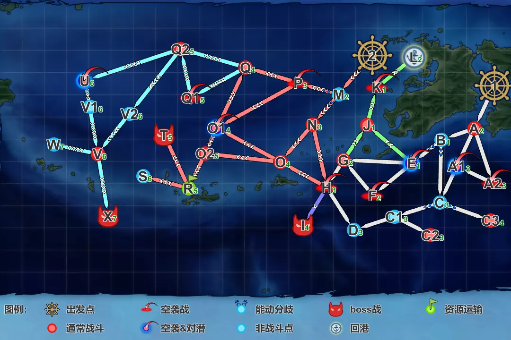
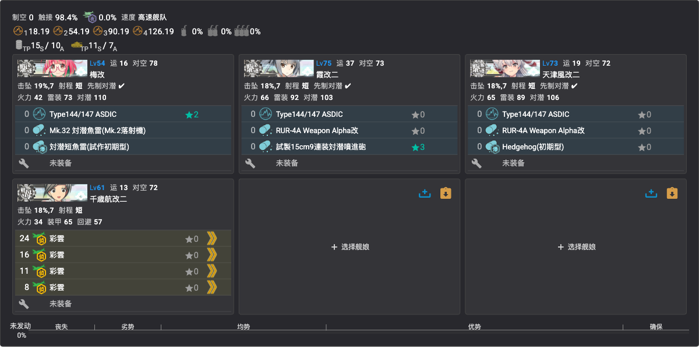
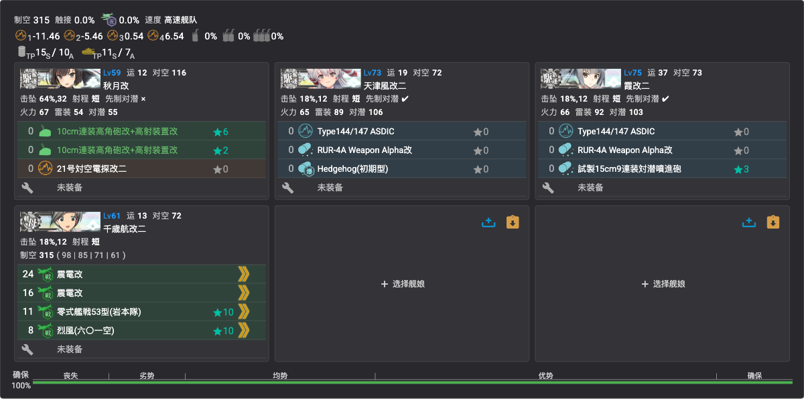
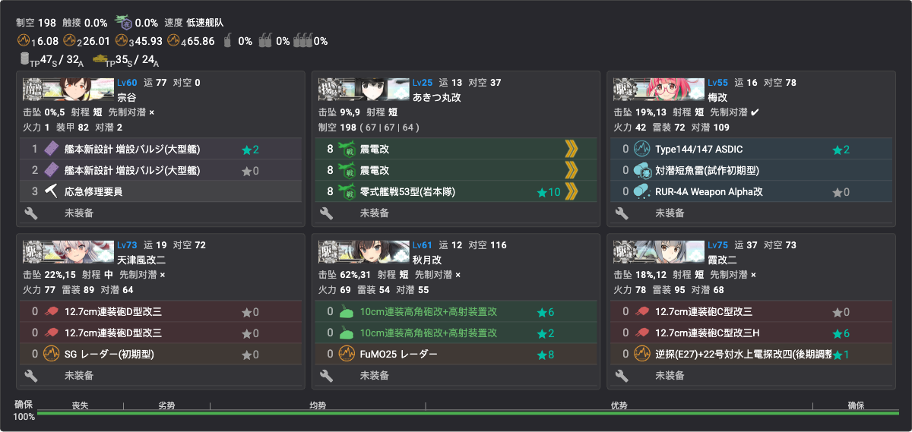
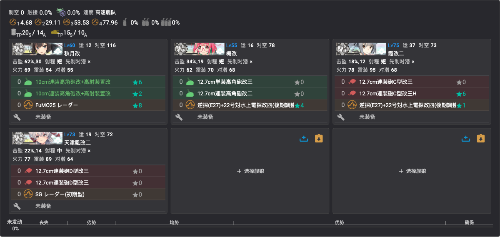
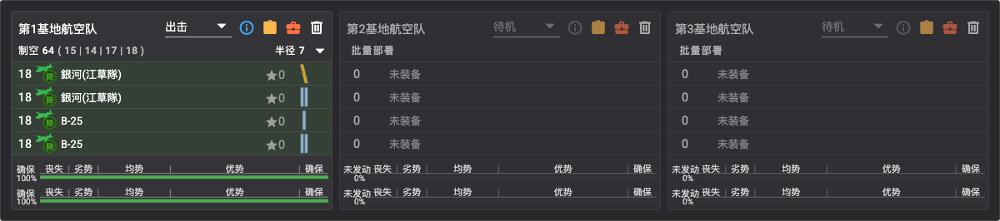
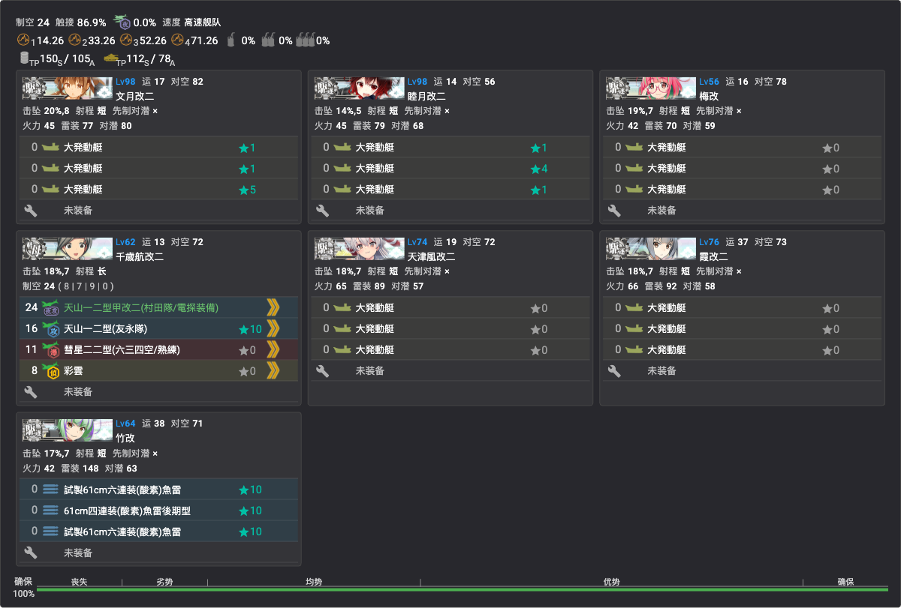
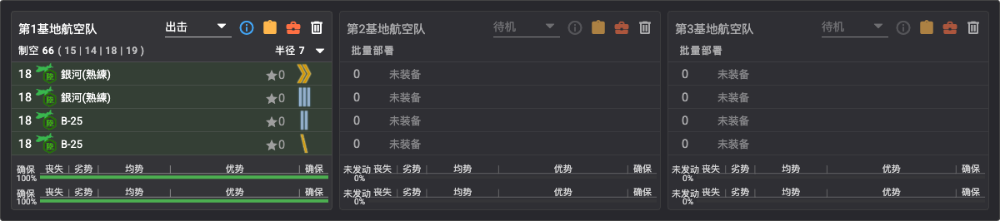

# E1 九州沖/南西諸島沖【第三十一戦隊駆逐艦の出撃】

> **海域**：**E1** · [E2](../E2/概览.md) · [E3](../E3/概览.md) · [E4](../E4/概览.md) · [E5](../E5/概览.md)
> **阶段**：[地图](#地图) · [带路条件](#带路条件分歧点) · [通关流程](#通关流程) · [解谜·开P1](#解谜开-p1-boss) · [解谜·开P2](#解谜开-p2-boss) · [P1（攻坚）](#p1攻坚boss-i-点) · [P2（输送）](#p2输送-tp) · [P3/斩杀](#p3攻坚-斩杀ラスダン)

## 基本信息
- **作战名**：第三十一戦隊駆逐艦の出撃
- **札**：「第三十一戦隊」（P1/P2，出发点1）、「増強第三十一戦隊」（P2/P3，出发点2）——増強舰队**全难度可与第三十一戦隊条混编**
- **阶段**：共三条血条 —— **P1（攻坚）→ P2（输送 TP）→ P3（攻坚，有削甲）**
- **解锁条件**：活动开放即入（前段第一图）

## 地图

- **出发点**：①（右侧近九州）、②（右上，随作战推进解锁）
- **boss 点**：**I**（P1）、**T**（P2）、**X**（P3）
- **L 点**：回港（进出佐世保）；**R 点**：P2 揚陸点
- 解谜点位 C2、C3、F、H 均在起始区域附近

## 路线与机制
- 主力舰种：驱逐为核心，可用**基地航空队**；作战推进后**进出佐世保**、开放**游击部队（7舰编成）**
- 第一段以对潜为主（南九州近海敌潜部队）
- 随作战推进解锁：**第2出发点**、E-J / G-J / H-I 路线

### 带路条件（分歧点）
> 各分歧点详细条件表见参考文档：**[海域分歧条件 by ゆめみ（NGA）](https://bbs.nga.cn/read.php?tid=47140252)**
>
> 实战要点：三处**索敌门**——C1→C2（系数2，约≥65）、H→I 即 P1 boss（系数4，约≥75）、V→X 即 P3 boss（系数4，约≥80），索敌不足会被踢去 D/W 点；第2出发点开启后，**7 舰**或 **DD+DE=6** 的舰队自动从出发点 2 出击（贴増強札）。

## 特效（倍卡）
> 倍率数据（全图舰种/分组/点位加算）见参考文档：**[2026夏活检证情报文档（Google Docs）](https://docs.google.com/document/d/1cJ66SdOAH_EIerB3OuGH05lXk7bTl45VGlwbYZRCqDg/edit?tab=t.0)**；倍卡计算方法见 [简易倍卡学（NGA）](https://bbs.nga.cn/read.php?tid=41906460)

## 通关流程
1. **解谜开 P1 boss**（条件见下）✅
2. **攻坚 P1**（boss：I 点，ヌ级 118 血）✅ 2026-07-09 击破
3. **解谜开 P2 boss** ✅
4. **输送 P2**（TP 条，boss：T 点 战舰夏姬 530 血）✅ 2026-07-09 击破
5. **攻坚 P3** →（**削甲**，流程待确认）→ **斩杀 P3**

### 解谜：开 P1 boss
| 条件 | 次数 |
|------|------|
| C2 点 S 胜 | ×2 |
| C3 点 S 胜 | ×2 |
| F 点航空优势 | ×2 |
| H 点到达 | ×1 |

### 解谜编成：C2 / C3 点 S 胜（实战记录）

- **编成**：梅改、霞改二、天津风改二（3DD 全员先制反潜）＋千岁航改二（彩云×4，索敌担当）——4 舰高速
- 💡 尽量用**复制人**吃札，本命留给正式攻坚
- **路线**：
  - C2：**1（出发）→ A（炸鱼）→ B（能动）→ C（能动）→ C1（无战斗）→ C2（炸鱼）**
  - C3：**1（出发）→ A（炸鱼）→ B（能动）→ C（能动）→ C3（炸鱼）**
- **阵型**：A 警戒 · C2 警戒 / C3 警戒
- ⚠️ **索敌沟**：C1→C2 有索敌判定（系数2，约≥65），**不足被踢去 D 点**；千岁彩云×4 即为填索敌，换编成时先核索敌

### 解谜编成：F 点航空优势 / H 点到达（实战记录）

- **编成**：秋月改（对空 CI：双高角炮+高射装置、对空电探）、天津风改二、霞改二（先制反潜）＋千岁航改二（**全战斗机**：震电改×2、岩本队★10、烈风六〇一空★10）——4 舰高速，**制空 315**
- **路线**：**1（出发）→ A（炸鱼）→ B（能动）→ E（空袭&对潜）→ F（空袭）→ G（轻水雷）→ H（空袭）→ D（无战斗）**——一次出击同时推进 F 优势与 H 到达
- **阵型**：A 警戒 · E 警戒 · F 警戒 · G 警戒 · H 警戒
- ⚠️ **对空**：F 点拿优势需**制空 300 以上**；道中空袭点多，秋月级对空 CI 减伤

### 解谜：开 P2 boss
| 条件 | 次数 |
|------|------|
| L 点到达 | ×2 |
| 基地（防空）优势 | ×2 |

### 解谜编成：L 点到达（实战记录）

- **编成**：宗谷（バルジ×2＋应急修理要员）、あきつ丸改（震电改×2＋岩本队★10，**制空 198**）、梅改（先制反潜）、天津风改二、秋月改（对空 CI＋FuMO25）、霞改二——6 舰低速
- **路线**：**1（出发）→ A（炸鱼）→ B（能动）→ E（空袭&对潜）→ J（轻水雷）→ K（空袭）→ L（无战斗，到达）**
- **阵型**：A 警戒 · E 警戒 · J 警戒 · **K 轮形**（空袭点轮形，其余警戒）
- 宗谷＋あきつ丸凑出 **AV+AO+LHA≥2**，触发 E→J 分歧（需 E-J 路线已开通）

## 各阶段攻略
### P1（攻坚，boss I 点）
✅ **已击破**（2026-07-09）

- **boss**：I 点，**ヌ级（轻空母）旗舰 118 血**
- **编成**：秋月改（对空 CI＋FuMO25★8）、梅改（高角炮×2＋逆探+22号电探改四）、霞改二（C型改三×2＋逆探+22号电探改四）、天津风改二（D型改三×2＋SG 雷达）——4DD 高速
- **路线**：**1（出发）→ A（炸鱼）→ B（能动）→ E（空袭&对潜）→ G（轻水雷）→ H（空袭）→ I（boss）**
- **阵型**：A 警戒 · E 警戒 · G 警戒 · H 警戒 · **I 单纵**
- **基地航空队**（仅 1 队可用）：银河(江草队)×2＋B-25×2——制空 64、半径 7，集中 I 点（boss）

  

- 全员堆电探/逆探是为过 H→I 索敌门（系数4，约≥75）；DD=4 且 4 舰的编成在 E 点走 G（避开 F 空袭）

### P2（输送 TP）
✅ **已击破**（2026-07-09）

- **boss**：T 点，**战舰夏姬 530 血**
- **编成**（游击部队 7 舰，出发点 2）：文月改二、睦月改二、梅改、天津风改二、霞改二（各大发动艇×3）＋千岁航改二（村田队/友永队★10/彗星六三四空/彩云）＋竹改（鱼雷 CI：试制六连装酸素鱼雷★10×2＋四连装后期型★10）——高速，**TP 150(S)/105(A)**
- **路线**：**2（出发）→ M（能动）→ N（轻水雷）→ O（炸鱼）→ O2（重水雷）→ R（扬陆点）→ T（boss）**
- **阵型**：N 警戒 · O 警戒 · O2 警戒 · **T 单纵**
- **基地航空队**：银河(熟练)×2＋B-25×2（制空 66、半径 7），集中 T 点（boss）

  

- 7 舰自动从出发点 2 出击（増強札）；DD=6 满足 O→O2 分歧

### P3（攻坚）/ 斩杀（ラスダン）
- 血条变化 / 装甲破碎流程：
- 友军选择：（前段初期通常无友军）

## 乙/丙难度差异
- 

## 掉落
| 点位 | 掉落 | 难度限定 |
|------|------|----------|
| 待确认 | **新船：桐（松型驱逐）、花月（秋月型防空驱逐）** | 待确认 |
| 待确认 | 杉、榧、竹、梅、桃（松型/丁型驱逐） | |
| 待确认 | 丁型海防舰 | |
| 待确认 | 冬月、涼月（秋月型） | |

## 参考链接
- [2026夏活检证情报文档（Google Docs）](https://docs.google.com/document/d/1cJ66SdOAH_EIerB3OuGH05lXk7bTl45VGlwbYZRCqDg/edit?tab=t.0) — 本页倍卡/解谜数据来源
