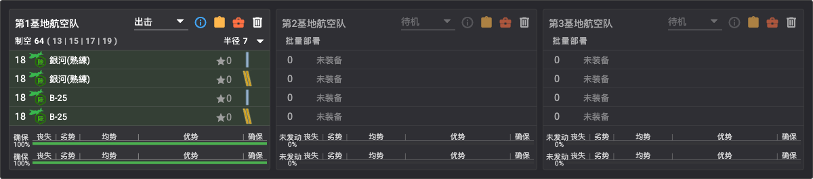
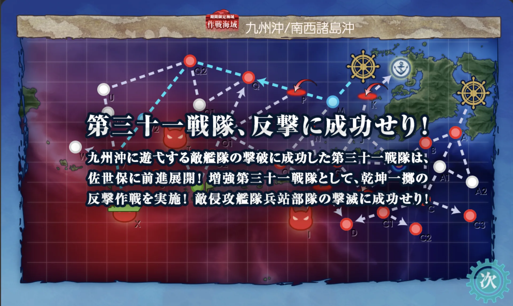

# E1 九州沖/南西諸島沖【第三十一戦隊駆逐艦の出撃】

> **海域**：**E1** · [E2](../E2/概览.md) · [E3](../E3/概览.md) · [E4](../E4/概览.md) · [E5](../E5/概览.md)
> **阶段**：[地图](#地图) · [带路条件](#带路条件分歧点) · [通关流程](#通关流程) · [解谜·开P1](#解谜开-p1-boss) · [P1（攻坚）](#p1攻坚boss-i-点) · [解谜·开P2](#解谜开-p2-boss) · [P2（输送）](#p2输送-tp) · [削甲](#解谜削甲p3-boss-装甲破碎) · [P3/斩杀](#p3攻坚-斩杀ラスダン) · [突破奖励](#突破奖励)

## 基本信息
- **作战名**：第三十一戦隊駆逐艦の出撃
- **札**：「第三十一戦隊」（P1/P2，出发点1）、「増強第三十一戦隊」（P2/P3，出发点2）——増強舰队**全难度可与第三十一戦隊条混编**
- **阶段**：共三条血条 —— **P1（攻坚）→ P2（输送 TP）→ P3（攻坚，有削甲）**
- **解锁条件**：活动开放即入（前段第一图）

## 地图

- **出发点**：①（右侧近九州）、②（右上，随作战推进解锁）
- **boss 点**：**I**（P1）、**T**（P2）、**X**（P3）
- **L 点**：回港（进出佐世保）；**R 点**：P2 揚陸点
- 解谜点位 C2、C3、F、H 均在起始区域附近

## 路线与机制
- 主力舰种：驱逐为核心，可用**基地航空队**；作战推进后**进出佐世保**、开放**游击部队（7舰编成）**
- 第一段以对潜为主（南九州近海敌潜部队）
- 随作战推进解锁：**第2出发点**、E-J / G-J / H-I 路线

### 带路条件（分歧点）
> 各分歧点详细条件表见参考文档：**[海域分歧条件 by ゆめみ（NGA）](https://bbs.nga.cn/read.php?tid=47140252)**
>
> 要点（甲，据带路贴）：四处**索敌门**——C1→C2（系数4 **≥66**）、H→I 即 P1 boss（系数4 **≥73**）、R→T 即 P2 boss（系数4 **≥72**）、V→X 即 P3 boss（系数4 **≥80**），索敌不足被踢去 D/S/W 点；第2出发点开启后，**7 舰**或 **DD+DE=6** 的舰队自动从出发点 2 出击（贴増強札）。

## 特效（倍卡）
> 数据来源：**[2026夏活检证情报文档（Google Docs）](https://docs.google.com/document/d/1cJ66SdOAH_EIerB3OuGH05lXk7bTl45VGlwbYZRCqDg/edit?tab=t.0)**；倍卡计算方法见 [简易倍卡学（NGA）](https://bbs.nga.cn/read.php?tid=41906460)

### 全图
- 舰种：DD 1.03 · DE 1.12 · CL 1.05 · CVL 1.06 · AV 1.08 · AS 1.08
- 分组：

| 组 | 舰娘 | 倍率 |
|----|------|------|
| A组 | 五十铃 酒匂 朝霜 初霜 长波 岸波 高波 冲波 雪风 凉月 潮 松 桃 梅 卯月 择捉 福江 御藏 对马 | 1.03 |
| B组 | 北上 冬月 花月 | 1.06 |
| C组 | 竹 杉 榧 樫 桐 | 1.06 |
| D组 | 宗谷 | 1.18 |

### 点位追加
- **C2/C3/G/J/O1/O2/Q/Q2/U/V**：DD 1.05 · DE 1.05 · A组 1.06 · B组 1.16 · C组 1.16
- **boss 点（I/T/X）**：DE 1.07 · DD 1.07 · CL 1.08 · **CT 1.08** · CA系 1.08 · BB系 1.08 · A组 1.09 · B组 1.21 · C组 1.21

## 通关流程
1. **解谜开 P1 boss** ✅
2. **攻坚 P1**（boss：I 点，ヌ级 118 血）✅ 2026-07-09 击破
3. **解谜开 P2 boss** ✅
4. **输送 P2**（TP 条，boss：T 点 战舰夏姬 530 血；**可用游击部队**）✅ 2026-07-09 击破
5. **攻坚 P3** →（**削甲**，可选，条件见下）→ **斩杀 P3**（boss：X 点，驱逐ラ级ζ 660 血）✅ 2026-07-09 突破——**E1 全海域突破**

> 全程**未使用支援舰队**

### 解谜：开 P1 boss
| 条件 | 次数 |
|------|------|
| C2 点 S 胜 | ×2 |
| C3 点 S 胜 | ×2 |
| F 点航空优势 | ×2 |
| H 点到达 | ×1（需进入战斗，制空状态无关） |

> 另有情报称最后一项为 D 点到达×2（未检证；本攻略按 H 到达×1 完成）

#### 解谜编成：C2 / C3 点 S 胜（实战记录）

- **贴条**：「第三十一戦隊」（出发点1）
- **编成**：梅改、霞改二、天津风改二（3DD 全员先制反潜）＋千岁航改二（彩云×4，索敌担当）——4 舰高速
- 💡 尽量用**复制人**吃札，本命留给正式攻坚
- **路线**：
  - C2：**1（出发）→ A（炸鱼）→ B（能动）→ C（能动）→ C1（无战斗）→ C2（炸鱼）**
  - C3：**1（出发）→ A（炸鱼）→ B（能动）→ C（能动）→ C3（炸鱼）**
- **阵型**：A 警戒 · C2 警戒 / C3 警戒
- **敌编成（甲）**：C2/C3 均为潜水カ级×3（梯形/单横）
- ⚠️ **索敌沟**：C1→C2 有索敌判定（系数4，≥66），**不足被踢去 D 点**；千岁彩云×4 即为填索敌，换编成时先核索敌

#### 解谜编成：F 点航空优势 / H 点到达（实战记录）

- **贴条**：「第三十一戦隊」（出发点1）
- **编成**：秋月改（对空 CI）、天津风改二、霞改二（先制反潜）＋千岁航改二（**全战斗机**）——4 舰高速，**制空 315**
- **路线**：**1（出发）→ A（炸鱼）→ B（能动）→ E（空袭&对潜）→ F（空袭）→ G（轻水雷）→ H（空袭）→ D（无战斗）**——一次出击同时推进 F 优势与 H 到达
- **阵型**：A 警戒 · E 警戒 · F 警戒 · G 警戒 · H 警戒
- **敌编成（甲）**：F/H 同款——ヌ级系轻母×1~2＋ネ级＋ツ级＋后期イ级×2（轮形）；敌制空最高档**优势线 300／确保 600**
- ⚠️ **对空**：F 点拿优势需**制空 300 以上**；道中空袭点多，秋月级对空 CI 减伤

### P1（攻坚，boss I 点）
✅ **已击破**（2026-07-09）

- **boss**：I 点，**ヌ级（轻空母）旗舰 118 血**
- **敌编成（甲）**：ヌ级改＋ネ级×2（斩杀档带ネ改夏）＋ツ级＋后期イ级×2（单纵）；优势线 161~300
- **贴条**：「第三十一戦隊」（出发点1）
- **编成**：秋月改（对空 CI）、梅改、霞改二、天津风改二（各主炮×2＋电探/逆探）——4DD 高速
- **路线**：**1（出发）→ A（炸鱼）→ B（能动）→ E（空袭&对潜）→ G（轻水雷）→ H（空袭）→ I（boss）**
- **阵型**：A 警戒 · E 警戒 · G 警戒 · H 警戒 · **I 单纵**
- **基地航空队**（仅 1 队可用）：银河(江草队)×2＋B-25×2——制空 64、半径 7，集中 I 点（boss）

  

- 全员堆电探/逆探是为过 H→I 索敌门（系数4，≥73）；DD=4 且 4 舰的编成在 E 点走 G（避开 F 空袭）
- 情报补充：boss 实为 **ヌ级改**，随伴弱，**斩杀时随伴出ネ改**；有闲置潜艇可用潜水舰队轻松打，战舰1+轻空1+轻巡1+驱逐3（可低速）亦可

### 解谜：开 P2 boss
| 条件 | 次数 |
|------|------|
| L 点到达 | ×2 |
| 基地（防空）优势 | ×2（出击过程中敌空袭自动触发，配好防空即可） |

#### 解谜编成：L 点到达（实战记录）

- **贴条**：「第三十一戦隊」（出发点1）
- **编成**：宗谷（带路）、あきつ丸改（全战斗机，**制空 198**）、梅改（先制反潜）、天津风改二、秋月改（对空 CI）、霞改二——6 舰低速
- **路线**：**1（出发）→ A（炸鱼）→ B（能动）→ E（空袭&对潜）→ J（轻水雷）→ K（空袭）→ L（无战斗，到达）**
- **阵型**：A 警戒 · E 警戒 · J 警戒 · **K 轮形**（空袭点轮形，其余警戒）
- 宗谷＋あきつ丸凑出 **AV+AO+LHA≥2**，触发 E→J 分歧（需 E-J 路线已开通）

### P2（输送 TP）
✅ **已击破**（2026-07-09）

- **boss**：T 点，**战舰夏姬 530 血**
- **敌编成（甲）**：战舰夏姬＋ル级×1~2＋后期イ级×3~4（单纵，无舰载机）
- **TP 总量**：600（甲）——本编成 TP150(S)，恰好 4 次
- **贴条**：「増強第三十一戦隊」（出发点2，7 舰自动判定）
- **编成**（游击部队 7 舰）：文月改二、睦月改二、梅改、天津风改二、霞改二（各大发×3）＋千岁航改二（攻击机＋彩云）＋竹改（鱼雷 CI）——高速，**TP 150(S)/105(A)**
- **路线**：**2（出发）→ M（能动）→ N（轻水雷）→ O（炸鱼）→ O2（重水雷）→ R（扬陆点）→ T（boss）**
- **阵型**：N 警戒 · O 警戒 · O2 警戒 · **T 单纵**
- **基地航空队**：银河(熟练)×2＋B-25×2（制空 66、半径 7），集中 T 点（boss）

  

- DD=6 满足 O→O2 分歧
- 情报补充：随伴弱（ル级战舰×2 左右）；水母1+轻巡1+驱逐5（可低速）亦可

### 解谜：削甲（P3 boss 装甲破碎）
> 效果：**驱逐ラ级ζ 装甲 -41**（作用于 P2 boss T／P3 boss X）

| 条件 | 次数 |
|------|------|
| F 点航空优势 | ×1 |
| A2 点航空优势 | ×1 |
| L 点到达 | ×2 |
| I 点（P1 boss）S 胜 | ×2（轻巡2+驱逐4 可到达） |
| T 点（P2 boss）S 胜 | ×2 |
| 基地（防空）优势 | ×2 |

- **解除判定**：X 点 boss 立绘颜色由**橙转红**即削甲完成

> 💡 **本页攻略实战未做削甲**，直接斩杀成功——削甲为可选项，斩杀不顺时再做。

### P3（攻坚）/ 斩杀（ラスダン）
✅ **已突破**（2026-07-09，**未削甲**）

- **boss**：X 点，**驱逐ラ级ζ 660 血**（**持先制雷击**），随伴弱
- **敌编成（甲）**：ラ级ζ（斩杀 -坏）＋ワ级×1~2＋后期イ级×2~3（复纵）
- **贴条**：「増強第三十一戦隊」（出发点2，7 舰自动判定）
- **编成**（游击部队 7 舰）：吹雪改三（夜战连击＋见张员）、秋月改（对空 CI）、梅改、天津风改二、Mogador改（探照灯打杂）、霞改二（鱼雷 CI）、竹改（鱼雷 CI）——7DD 高速
- **路线**：**2（出发）→ M（能动）→ P（空袭）→ Q（轻水雷）→ Q2（炸鱼）→ V2（无战斗）→ V（轻水雷）→ X（boss）**
- **阵型**：**P 轮形** · Q 警戒 · Q2 警戒 · V 警戒 · **X 单纵**
- **基地航空队**：银河(熟练)×2＋B-25×2（制空 64、半径 7），集中 X 点（boss）

  

- DD=7 满足 Q2→V2 分歧（**轻巡1+驱逐6 会偏航，DD7 最短**）；V→X 为全图最高索敌门（系数4，约≥80），全员电探压线

### 突破奖励

- 勋章×1、间宫×3
- 二选一：**装备栏+5** 或 紫菜×45
- 二选一：工厂资源×2 或 女神×1
- 二选一：**油×4800** 或 伊良湖×3
- 12.7cm单装高角炮改二
- 25mm连装机枪（熟练机枪员分队）★+1
- 12.7cm单装高角炮改三★+2

## 掉落
- **新船：桐（松型驱逐）、花月（秋月型防空驱逐）**
- 实测：X 点（P3 boss）——第三十号海防舰
