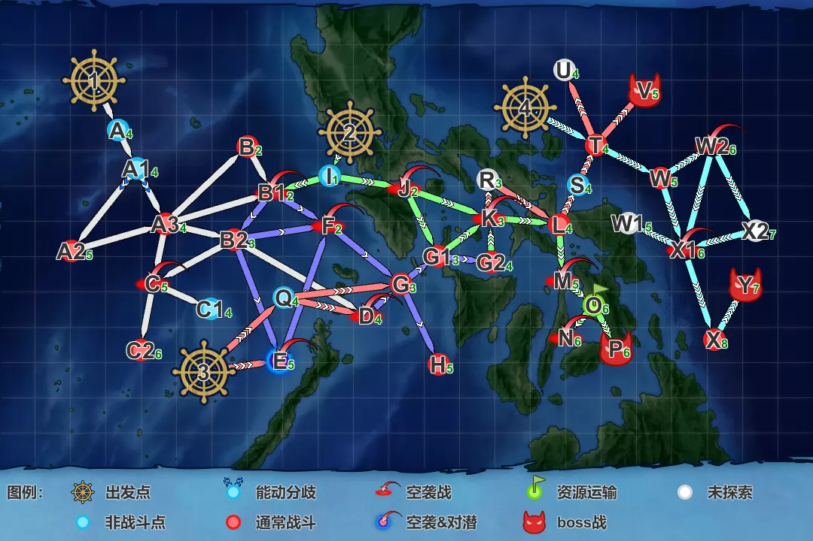
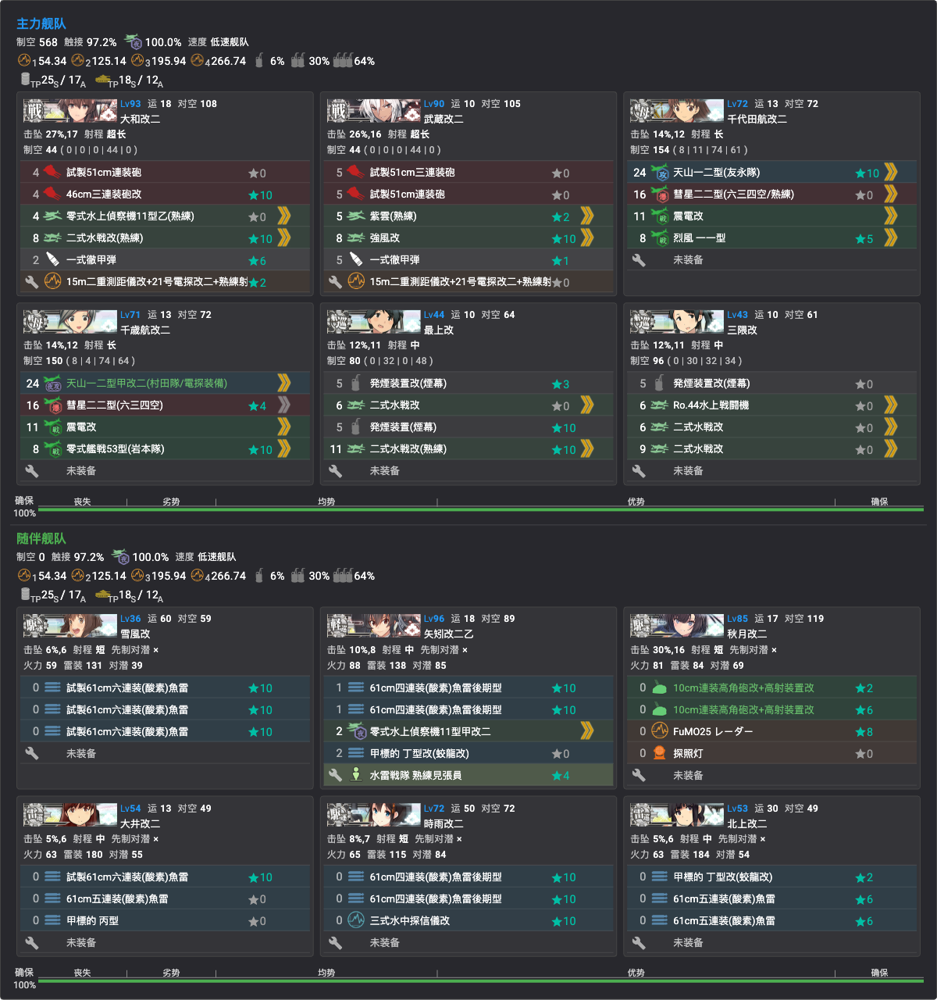
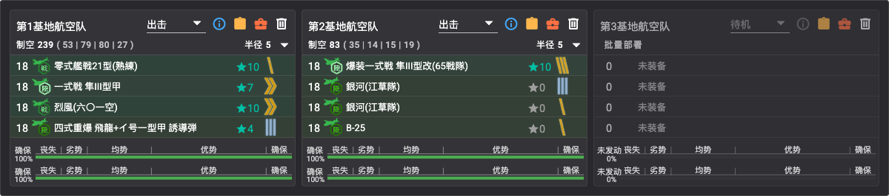
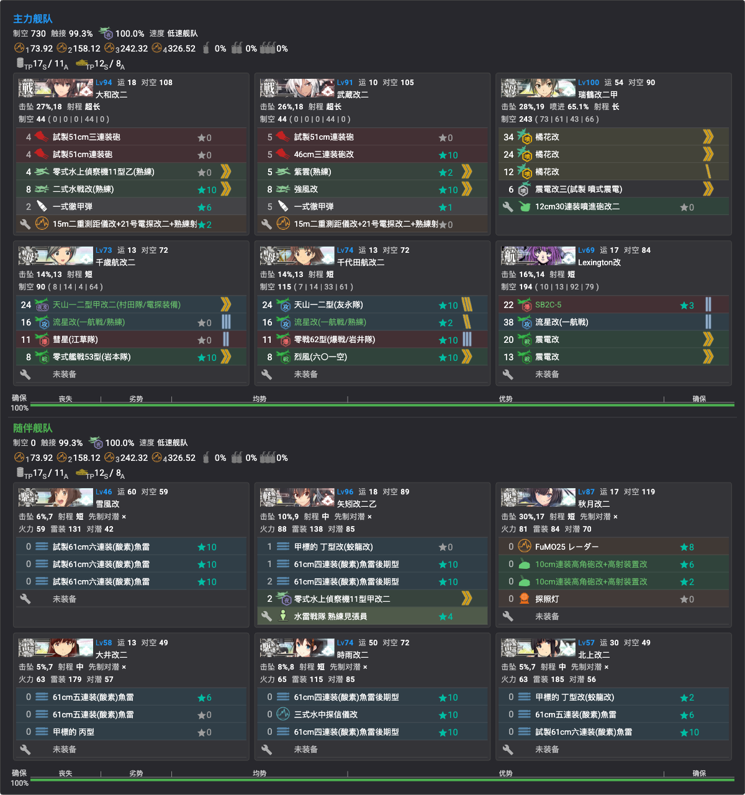
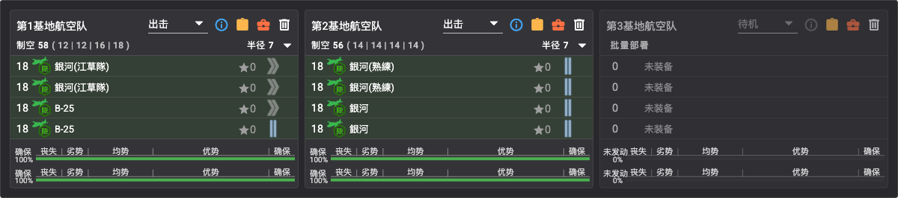

# E2 南沙諸島沖/オルモック沖/サンベルナルジノ海峡沖【サンベルナルジノ海峡 通峡】

> **海域**：[E1](../E1/概览.md) · **E2** · [E3](../E3/概览.md) · [E4](../E4/概览.md) · [E5](../E5/概览.md)
> **阶段**：[地图](#地图) · [带路条件](#带路条件分歧点) · [通关流程](#通关流程) · [解谜·开路](#解谜开路) · [解谜·开P1boss](#解谜开-p1-boss--第二出发点) · [P1（输送）](#p1输送) · [P2（攻坚）](#p2攻坚) · [削甲](#解谜削甲p3-斩杀前) · [P3/斩杀](#p3攻坚-斩杀ラスダン) · [突破奖励](#突破奖励)

## 基本信息
- **作战名**：サンベルナルジノ海峡 通峡（圣贝纳迪诺海峡 通峡）
- **札**：「第三十一戦隊」「増強第三十一戦隊」（沿用 E1）、「多号作戦部隊」、「連合艦隊」
- **札与血条对应**：两段解谜=三十一戦隊系；**P1 输送=多号作戦部隊；P2/P3=連合艦隊**（P2 实测**水上打击**可行、P3 空母机动——情报所称"空母机动固定"与实测不符）
- **阶段**：**三条血条 —— P1（输送）→ P2（攻坚）→ P3（攻坚，削甲待确认）**；另有开路解谜与第二出发点
- **解锁条件**：与 E1 同日开放（是否需 E1 通关待确认）
- **突破奖励**：**新舰娘 Reno（Atlanta 级防空巡洋舰二番舰）**等，完整清单见[突破奖励](#突破奖励)

## 地图

- **出发点×4**：①左上（解谜起点）、②中上（P1 多号输送）、③左下（P2 連合）、④右上（P3 連合）
- **boss 点**：**P**（P1 输送）、**V**（P2）、**Y**（P3）
- **O 点**：P1 揚陸点（绿旗）

## 路线与机制
- 舞台：菲律宾方面（南沙群岛近海 → 奥尔莫克近海 → 圣贝纳迪诺海峡）
- **随作战推进基地航空队可增强**（实测第2队随进度开放）
- P2/P3 为**連合艦隊**（P2 水上打击实测、P3 空母机动）

### 带路条件（分歧点）
> 各分歧点详细条件表见参考文档：**[海域分歧条件 by ゆめみ（NGA）](https://bbs.nga.cn/read.php?tid=47140252)**（已更新 E2）
>
> 实测：**DD≤1 → B（潜水点）**

## 特效（倍卡）
> 倍率数据见 [2026夏活检证情报文档](https://docs.google.com/document/d/1cJ66SdOAH_EIerB3OuGH05lXk7bTl45VGlwbYZRCqDg/edit?tab=t.0)；史实推测（多号作战参战舰、栗田舰队相关舰）见[札系统·各札史实参与舰](../../00-活动总览/札系统与出击限制.md#各札史实参与舰推测)

## 通关流程
1. **解谜开路**（条件见下）
2. **解谜开 P1 boss / 第二出发点**
3. **输送 P1**（TP 条，**甲 TP765**；boss：ム级）✅ 2026-07-10 击破
4. **攻坚 P2**（boss：試作空母姬バカンス）✅ 2026-07-11 击破
5. **攻坚 P3** →（**削甲**✅，条件见下）→ **斩杀 P3**（boss：Y 点，**防空巡新棲姬**《新》）✅ 2026-07-11 突破——**E2 全海域突破**

### 解谜：开路
> 使用札：第三十一戦隊 / 増強第三十一戦隊

| 条件 | 次数 |
|------|------|
| C2 点 S 胜（**A 胜不可**；ラ级点） | ×3 |
| D 点航空优势（空袭点） | ×2 |

#### 解谜编成：C2 点 S 胜（实战记录）

- **贴条**：「増強第三十一戦隊」（沿用 E1 札，实测可进 E2）
- **编成**：竹改（鱼雷 CI ★10）、秋月改（对空 CI＋FuMO25★8）、梅改、天津风改二、吹雪改三（鱼雷 CI＋见张员）、霞改二（鱼雷 CI ★10×3）——6DD 高速
- **路线**：**1（出发）→ A（无战斗）→ A1（能动）→ A2（轻水雷）→ A3（轻水雷）→ C（空袭）→ C2（驱逐ラ级）**
- **阵型**：A2 警戒 · A3 警戒 · **C 轮形** · **C2 单纵**（空袭轮形、目标点单纵、其余警戒）

#### 解谜编成：D 点航空优势（实战记录）

- **贴条**：「増強第三十一戦隊」
- **编成**：千代田航改二（**全战斗机**：震电改×2、岩本队★10、烈风六〇一空★10）、梅改、霞改二、吹雪改三（先制反潜×3）、天津风改二、秋月改（对空 CI＋FuMO25）——6 舰高速，**制空 315**
- **路线**：**1（出发）→ A（无战斗）→ A1（能动）→ A2（轻水雷）→ A3（轻水雷）→ B2（炸鱼）→ D（空袭）**
- **阵型**：A2 警戒 · A3 警戒 · B2 警戒 · **D 轮形**
- ⚠️ **D 点敌制空过高，舰队自身制空拿不到优势——需陆航战斗机队打 D 点压制**后才能达成航空优势

### 解谜：开 P1 boss / 第二出发点
> 使用札：第三十一戦隊 / 増強第三十一戦隊

| 条件 | 次数 |
|------|------|
| G2 点 S 胜（PT 点） | ×2 |
| H 点 S 胜（軽巡新棲姬＋ラ级；A 胜是否可待确认） | ×3 |
| B 点 S 胜（潜水点） | ×1 |
| 基地（防空）优势 | ×2（出击过程中敌空袭自动触发，配好防空即可，无需专门跑） |

#### 解谜编成：G2 点 S 胜（实战记录）

- **贴条**：「増強第三十一戦隊」
- **编成**（PT 特化）：秋月改（高角炮×2＋FuMO25）、梅改（先制反潜）、吹雪改三（见张员＋25mm机枪分队）、天津风改二（见张员＋Bofors 40mm）、霞改二（**装甲艇(AB艇)★10**＋见张员）、千代田航改二（F4U-4＋震电改×2＋岩本队★10）——6 舰高速，制空 275
- **路线**：**1（出发）→ A（无战斗）→ A1（能动）→ A3（轻水雷）→ B1（空袭）→ F（空袭）→ G（炸鱼）→ G1（PT）→ G2（PT）**
- **阵型**：A3 警戒 · **B1 轮形** · **F 轮形** · G 警戒 · G1 警戒 · **G2 单纵**（同规则：空袭轮形、目标点单纵、其余警戒）
- 对 PT 配置：小口径主炮＋机枪＋水雷战队见张员＋装甲艇，命中拉满

#### 解谜编成：H 点 S 胜（实战记录）

- **贴条**：「増強第三十一戦隊」
- **编成**：竹改（鱼雷 CI）、霞改二（鱼雷 CI）、秋月改（对空 CI＋FuMO25）、**Roma改**（16inch Mk.6 mod.2★10×2＋彻甲弹）、千岁航改二（流星改一航战＋F4U-4＋震电改×2）、吹雪改三（见张员）——6 舰高速，制空 198
- **路线**：**1（出发）→ A（无战斗）→ A1（能动）→ A3（轻水雷）→ B1（空袭）→ F（空袭）→ G（炸鱼）→ H（軽巡新棲姬＋ラ级）**
- **阵型**：A3 警戒 · **B1 轮形** · **F 轮形** · G 警戒 · **H 单纵**
- ⚠️ **必须带支援舰队**——H 点敌阵（軽巡新棲姬＋ラ级）硬度高，无支援难以 S 胜

#### 解谜编成：B 点 S 胜（实战记录）

- **贴条**：三十一戦隊系混编（あきつ丸持「第三十一戦隊」、Roma 等持「増強」——两札混编出击）
- **编成**：あきつ丸改（三式指挥连络机×3，对潜）、吹雪改三（全反潜装备）、千代田航改二（村田/友永★10/流星改/彗星六三四）、Roma改——**4 舰**低速
- **路线**：**1（出发）→ A（无战斗）→ A1（能动）→ A3（轻水雷）→ B（炸鱼）**
- **阵型**：A3 警戒 · B 单横（对潜）
- **带路**：**DD≤1** 是进 B 点的条件（故只带吹雪一驱逐，其余用非驱逐凑）
- ⚠️ **舰队需 4 舰及以上才能选择阵型**——3 舰以下无阵型选单，对潜点会吃大亏，凑满 4 舰再出

### P1（输送）
✅ **已击破**（2026-07-10）

- **boss**：P 点，ム级（随伴 **PT**）
- **TP 总量**：765（甲）
- **贴条**：「多号作戦部隊」（第二出发点）
- **编成**（7 舰高速，**只追求 A 胜**，TP 101(A)/145(S)）：霞改二（旗舰，逆探+22号电探×2＋**精锐水雷战队司令部**，可退避）、皐月改二、三日月改、梅改（大发装载）、如月改二（八九式中战车★10×2＋特大发+III号战车）、夕暮改（**装甲艇(AB艇)★10**＋八九式）、秋月改（对空 CI＋SK雷达）
- **路线**：**2（出发）→ I（能动）→ J（空袭）→ K（空袭）→ L（ラ级）→ M（空袭）→ O（扬陆点）→ P（boss）**——道中空袭×3＋必踏ラ级点，与情报一致
- **阵型**：**J 轮形 · K 轮形** · L 警戒 · **M 轮形** · P 单纵——⚠️ **boss 点警戒阵疑似更优**（待验证）
- **基地航空队**（2 队可用）：第1队 银河(江草队)×2＋B-25×2 集中 boss；**第2队 防空**（试制震电×2＋试制秋水×2，制空 489）——顺带自动完成基地优势解谜

  

- ⚠️ 注意**索敌**（不足会被弹）与**对 PT 装备**（boss 随伴 PT：机枪/见张员/装甲艇留好）

### P2（攻坚）
✅ **已击破**（2026-07-11）

- **boss**：V 点，試作空母姬バカンス（斩杀时追加**空母夏姬Ⅱ**）；道中 T 点有 **ヌ级 133 血**
- **贴条**：「連合艦隊」（**水上打击部队**，**第三出发点**）
- **主力舰队**：大和改二（51cm连装炮＋46cm三连装炮改★10＋彻甲弹）、武藏改二（試製51cm×2＋彻甲弹）、千代田航改二/千岁航改二（友永/村田＋彗星六三四＋战斗机）、最上改（**发烟装置×2**＋二式水战）、三隈改（**发烟装置改**＋水战）——制空 568，低速
- **随伴舰队**：雪风改（鱼雷 CI）、矢矧改二乙（鱼雷 CI＋蛟龙改）、秋月改二（对空 CI＋探照灯）、大井改二（甲标的）、时雨改二（鱼雷 CI）、北上改二（蛟龙改）
- **路线**：**3（出发）→ Q（无战斗）→ D（空袭）→ G（炸鱼）→ G1（PT）→ K（空袭）→ L（驱逐ラ级）→ S（无战斗）→ T（ヌ级 133 血）→ V（boss）**
- **阵型**（连合舰队警戒航行序列）：**默认第二阵；对潜（G）第一阵；对空（D/K）第三阵；boss（V）第四阵**——四阵为触发**大和·武藏特殊攻击（武大摸）**的条件
- **拉烟**：**L 点（ラ级）开幕施放烟幕**（最上/三隈共三个发烟装置），规避先制雷击
- **支援**：**道中支援推荐**；斩杀时**决战支援也推荐**
- **基地航空队**：第1队 零战21熟练★10＋隼III甲＋烈风六〇一＋四式重爆飛龍(イ号诱导弹)★4（制空 239）；第2队 爆装隼65战队★10＋银河江草×2＋B-25——均出击（打点按削血/斩杀分配 boss 与道中）

  

### 解谜：削甲（P3 斩杀前）
| 条件 | 次数 |
|------|------|
| P 点（P1 boss）A 胜 | ×2 |
| V 点（P2 boss）A 胜 | ×2 |
| W2 点航空优势 | ×2（**斩杀道中顺路达成**，无需专跑） |
| H 点 S 胜 | ×2 |
| 基地（防空）优势 | ×2（**需配一队陆航防空**守家） |

> 💡 P/V/H 都是前面血条/解谜打过的点，**编成直接复用**：P 用多号输送队（A 胜即可）、V 用連合艦隊（A 胜即可）、H 用増強解谜队（带支援）。
> ✅ **本次攻略已完成削甲后斩杀**（与 E1 未削甲直斩不同，E2 尾王硬度值得做）。

### P3（攻坚）/ 斩杀（ラスダン）
✅ **已突破**（2026-07-11，**已削甲**）

- **boss**：Y 点，**防空巡新棲姬《新》**——血量削血段 240 / 斩杀段 290
- **随伴**：削血段 空母夏姬Ⅱ×2＋眉間棲艦水鬼《新》＋ネ改夏Ⅱ；斩杀段 空母夏姬Ⅱ×2＋眉間棲艦水鬼×2＋ネ改夏Ⅱ×2（眉間装甲有个体差，约 250/300）
- **贴条**：「連合艦隊」（空母机动，**第四出发点**）
- **主力舰队**：大和改二＋武藏改二（51cm 炮＋彻甲弹）、**瑞鶴改二甲（橘花改×3＋试制喷进震电——💡 瑞鹤在这里很强）**、千岁航改二、千代田航改二（村田/友永/岩井爆战/岩本）、**Lexington改**（SB2C-5＋流星改＋震电改×2）——**制空 730**，低速
- **随伴舰队**：雪风改（鱼雷 CI）、矢矧改二乙（蛟龙改＋见张员）、秋月改二（对空 CI＋FuMO25＋探照灯）、大井改二（甲标的）、时雨改二（鱼雷 CI）、北上改二（蛟龙改）——与 P2 相同
- **路线**：**4（出发）→ T（ヌ级）→ W（炸鱼）→ W2（空袭）→ X1（空袭）→ X（ル级）→ Y（boss）**
- **阵型**：T 二阵 · W 一阵 · W2 三阵 · X1 三阵 · X 二阵 · **Y 四阵（大和摸）**
- **基地航空队**：第1队 银河(江草队)×2＋B-25×2；第2队 银河(熟练)×2＋银河×2——均出击集中 boss

  

### 突破奖励
- 勋章×2、改修资材×6
- SB2U-2★+9
- 二选一：通信装置&要员 或 新型兵装资材×3
- 四式戦 疾風★+6、特四式内火艇改★+3、GFCS Mk.37
- **防空巡洋舰 Reno**（通关合流）

## 掉落
- **新船：Indiana（South Dakota 级战舰二番舰）**
- 捞船点位待测试（伊36/41、Atlanta 等），确认后录入 [03-捞船](../../03-捞船/掉落一览.md)
