# E3 パラオ沖/ウルシー泊地沖/中部太平洋【ウルシー泊地への本格反攻】

> **海域**：[E1](../E1/概览.md) · [E2](../E2/概览.md) · **E3** · [E4](../E4/概览.md) · [E5](../E5/概览.md)
> **阶段**：[地图](#地图) · [带路条件](#带路条件分歧点) · [通关流程](#通关流程) · [解谜·开P1boss](#解谜开-p1-boss--第二出发点) · [P1（攻坚）](#p1攻坚) · [P2（输送）](#p2输送) · [P3（攻坚）](#p3攻坚) · [削甲](#解谜削甲p4-斩杀前) · [P4/斩杀](#p4攻坚-斩杀ラスダン) · [突破奖励](#突破奖励)

> **前段作战决战海域**，与 E1/E2 同期开放。

## 基本信息
- **作战名**：ウルシー泊地への本格反攻（对乌利西泊地的本格反攻）
- **舞台**：帕劳近海 → 乌利西泊地近海 → 中部太平洋
- **札**：「第三十一戦隊」「増強第三十一戦隊」（沿用 E1/E2）、「第六艦隊」（潜艇部队）、「ウルシー攻撃部隊」（新札）
  - ⚠️ **E2 的「連合艦隊」札不能进 E3**——强袭主力需另建「ウルシー攻撃部隊」
- **阶段**：**四条血条 —— P1（攻坚）→ P2（输送）→ P3（攻坚）→ P4（攻坚，斩杀前削甲）**；另有开 P1 boss/第二出发点解谜
- **札与血条对应（实测）**：解谜=三十一戦隊系；**P1=ウルシー攻撃部隊**（⚠️ 第一条血条就要上新札）；P2 输送=三十一戦隊系；P3=第六艦隊（潜艇队）；P4=ウルシー攻撃部隊
- **解锁条件**：待确认（推测需 E2 通关）
- **突破奖励**：**新舰娘 Independence（高速轻空母）**——可改装为夜战轻空母；完整清单见[突破奖励](#突破奖励)
- **潜艇队**：伊36、伊41（E2 可捞，官方明示可在本图活跃）优先，另备伊47、伊58、伊53 等回天搭载舰——史实乌利西回天特攻组，大概率高倍特效
- **环礁泊地特殊攻击**：以潜艇战力为基轴（发动条件待检证）；乙丙丁可不用，甲大概率半强制
- **基地航空队前进配备**：完成强行输送后可前进配备至帕劳方面

## 地图
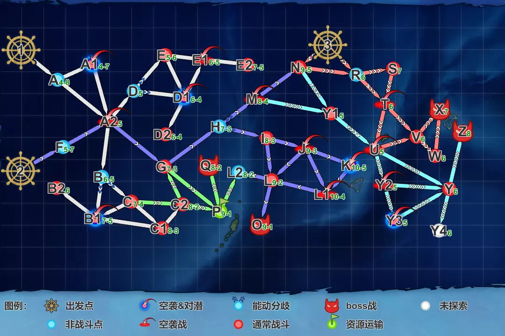

- **出发点×3**：①左上（三十一系：解谜/P2 输送）、②左下（ウルシー连合：P1/P4）、③右上（第六舰队潜艇队：P3）
- **boss 点**：**O**（P1）、**Q**（P2）、**X**（P3）、**Z**（P4）；**P 点**：P2 揚陸点（绿旗）

## 路线与机制
- **出发点自动判定**：三十一系单舰队/游击→①；连合舰队→②；潜艇队编成→③（判定条件见下）
- **基地航空队**：初期 2 队配置/1 队出击；**完成 P2 强行输送后前进配备帕劳方面，3 队配置/2 队出击**（实测 P3 起三队全用）
- P3 可发动**环礁泊地特殊攻击**（潜艇队特四式内火艇系为基轴）；P1/P4 走 H 点能动分歧（P1 选 I 方向、P4 选 M 方向）

### 带路条件（分歧点）
> 详细条件表见参考文档：**[海域分歧条件 by ゆめみ（NGA）](https://bbs.nga.cn/read.php?tid=47140252)**、[kcwiki E-3](https://zh.kcwiki.cn/wiki/2026%E5%B9%B4%E5%A4%8F%E5%AD%A3%E6%B4%BB%E5%8A%A8/E-3)
>
> 要点：
> - **出发点③判定（甲）**：**7 舰且 SS系≥4**，或 **7 舰且 AS≥1 且 SS系≥3**——P3 潜艇队（7 艇）与 W 削甲队（扶桑＋4潜＋云龙＋大凤）均满足
> - **索敌门**：P→Q 即 P2 boss 前（系数 4 **约≥80**，吹雪电探＋秋月 FuMO 补足）；**L→O**（P1 boss 前）与 **Y→Z**（P4 boss 前）也有索敌判定（线未测），不足分别被弹去 L2/Y4
>
> **boss 路线分歧**（甲）：
> - **P1**（2→…→O）：A2 点连合→G；H 能动分歧选 I 方向；I 点 **CV+CVB≤2 且 CL≥2 且 DD≥4 且高速 → L**（否则 J 点 **CL+CT≥2 且 DD+DE≥4 → L**）；L→O 索敌判定
> - **P2**（1→…→Q）：A 点 **高速+ 或（CV+CVB=0 且 CL系≥1 且 DD+DE≥3）→ A2**；C 点 **CL≥1 且 DD+DE≥5 且高速 → C2**（需 C-C2 路线开通）；C2 点 **DD+DE≥3 → P**；P→Q 索敌门
> - **P3**（3→…→X）：③点 **BB系+CV系=0 → R**；R 点低速→S；T 点 **AS+SS系≥5 → V**；V 点甲 **AS+SS系≥5 → X**
> - **P4**（2→…→Z）：H 能动选 M 方向；M 点 **BB系≤3 且 CV+CVB≤2 且 CL+CT≥2 → Y1**（需 M-Y1 开通，本队 2BB+2CV+多摩/Atlanta 恰好满足）；U 点低速→Y2；Y2 点 **BB系+CV+CVB≥7 或 CV系≥5 → Y3 削甲点**、其余→Y；Y→Z 索敌判定

## 特效（倍卡）
> 数据来源：[2026夏活检证情报文档](https://docs.google.com/document/d/1cJ66SdOAH_EIerB3OuGH05lXk7bTl45VGlwbYZRCqDg/edit?tab=t.0)；史实推测（回天潜艇队等）见[札系统·各札史实参与舰](../../00-活动总览/札系统与出击限制.md#各札史实参与舰推测)；「？」＝待检证

### 全图
- 舰种：DD 1.03 · DE 1.12 · CL 1.05 · CVL 1.06 · AV 1.08 · AS 1.08
- 分组：

| 组 | 舰娘 |
|----|------|
| 三十一舰队A | 五十铃 酒匂 朝霜 初霜 长波 岸波 高波 冲波 雪风 凉月 潮 松 桃 梅 卯月 择捉 福江 御藏 对马 |
| 三十一舰队B | 北上 冬月 花月 竹 杉 榧 樫 桐 |
| ウルシーA | 大和 长门 榛名 伊势 日向 大鲸(龙凤) 隼鹰 凤翔 八幡丸(云鹰) 矢矧 大淀 酒匂 鹿岛 北上 大井 |
| ウルシーB | 时雨 雪风 不知火 浜风 矶风 长波 浜波 朝霜 冲波 秋月 初月 凉月 冬月 花月 松 桃 梅 竹 杉 榧 樫 桐 岛风 初春 |
| ウルシーC | 美国人（美系舰） |
| 单独舰 | 速吸（不明）、大鹰（不明） |
| ウルシーA增强 | 大和 武藏 长门 陆奥 榛名 伊势 日向 大鲸(龙凤) 隼鹰 凤翔 八幡丸(云鹰) 最上 利根 矢矧 大淀 酒匂 鹿岛 北上 大井 |
| ウルシーB增强 | 时雨 雪风 不知火 浜风 矶风 吹雪 长波 冲波 玉波 浜波 凉波 朝霜 初月 秋月 凉月 冬月 花月 竹 松 桃 梅 杉 榧 樫 桐 岛风 初春 |

- 装备组：
  - **飞机A**（打空无效）：瑞雲(六三一空)、瑞雲(六三四空)/(熟練)、瑞雲改二(六三四空)/(熟練)、試製夜間瑞雲(攻撃装備)、試製晴嵐、晴嵐(六三一空)、流星改(友永隊)、流星改(一航戦)/(熟練)、天山一二型甲改二(村田隊/電探装備)、九七式艦攻改試製三号戊型(空六号電探改装備機)/(熟練)、天山一二型甲改(空六号電探改装備機)/(熟練)、彗星(江草隊)、彩雲(東カロリン空)、彩雲(偵四)
  - **飞机B**：一式戦 隼III型改(熟練/20戦隊)？

### 点位追加
- **A1/B1/B2/C/C1/C2/D1/D2/E/E2**：三十一舰队A 1.12 · 三十一舰队B 1.16
- **G/I/K/L/N 及 P1 boss O**：ウルシーA 1.08 · ウルシーB 1.14 · ウルシーC 1.08 · 飞机A 1架 1.08／2架 1.16／3架 ？ · 飞机B 1.02~1.07（重复不可）
- **S/V/W**：DD 1.12 · AS 1.38 · 日本SS 1.24（含伊503/伊504/吕500，**不含**其 U511/UIT25 等形态；**不含伊36/41**；伊26 无倍卡，原因不明）· **伊36/伊41 1.38**
- **Y/Y3**：ウルシーA增强 1.11 · ウルシーB增强 1.15 · ウルシーC 1.11
- **P2 boss Q**：三十一舰队A 1.12 · 三十一舰队B 1.16
- **P3 boss X**：DD 1.12 · AS 1.38 · 日本SS 1.24（注释同 S/V 点）· 伊36/伊41 1.38 · **SS装备特四式内火艇/改 1.95（不可叠加）** · SS装备晴岚系 1.25？（不可叠加，打空无效）· SS装备零式小型水上機/(熟練) 1.25？（不可叠加，打空无效，装于搭载0格无效）
- **P4 boss Z**：DD 1.1 · CL系（CL+CLT+CT）1.1 · CA系 1.1 · **AV 1.1** · BB系 1.1 · CV系（美系除外）1.12 · ウルシーA增强 1.08 · ウルシーB增强 1.14 · **ウルシーC 1.08×1.12＝1.2096**（即美系 CV 与其他美系舰均吃 1.12）· 飞机A 1架 1.11／2架 1.18／3架 1.28？ · 飞机B ？（重复不可）

## 通关流程
1. **解谜开 P1 boss / 第二出发点**（条件见下）✅
2. **攻坚 P1**（boss：O 点，深海擱座揚陸姬；札：ウルシー攻撃部隊）✅（2026-07-14）
3. **输送 P2**（TP 条，**甲 TP1000**；boss：Q 点，重巡夏姬；札：三十一戦隊系）✅（2026-07-15）
4. **攻坚 P3**（boss：X 点，環礁空母泊地棲姬；札：第六艦隊，潜艇队）✅（2026-07-15）
5. **攻坚 P4**（boss：Z 点，**高速軽空母首鬼**《新》耐久 1150；札：ウルシー攻撃部隊）→（**削甲**，条件见下）→ **斩杀 P4** ✅（2026-07-18，**E3 甲全通关**）

### 解谜：开 P1 boss / 第二出发点
> 使用札：第三十一戦隊 / 増強第三十一戦隊

| 条件 | 次数 | 状态 |
|------|------|------|
| C2 点 S 胜（ム级） | ×2 | ✅ |
| B2 点 S 胜（潜水姬） | ×2 | ✅ |
| D2 点 A 胜（潜水姬） | ×2 | ✅（实战按 S 胜达成） |
| E2 点 S 胜（軽巡新棲姬） | ×2 | ✅ |

> ✅ 四项全部达成（2026-07-12），P1 boss / 第二出发点已开。

#### 解谜编成：B2 点 S 胜（实战记录）
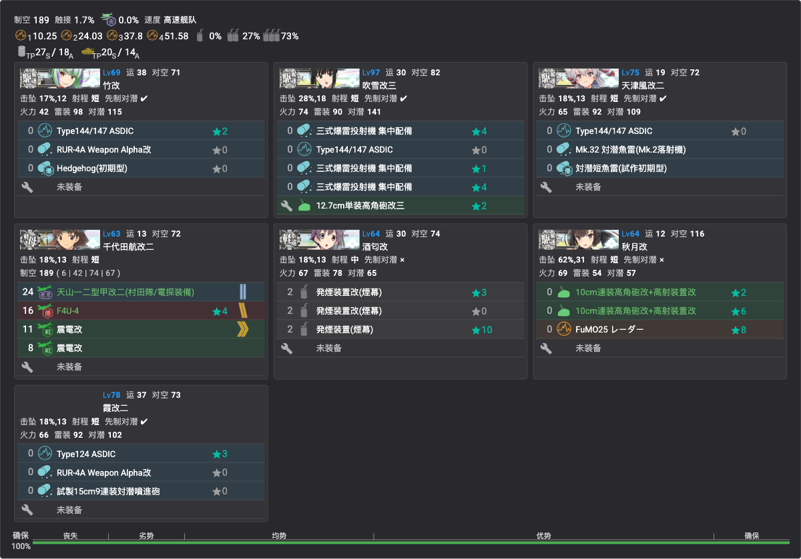

- **贴条**：三十一戦隊系（竹/吹雪/天津风/千代田/秋月/霞沿用；**酒匂改为本队新贴**）
- **编成**（对潜特化）：竹改、霞改二、天津风改二（先制反潜）、吹雪改三（对潜特化）、千代田航改二（舰攻＋战斗机）、**酒匂改（拉烟）**、秋月改（对空 CI）——7 舰高速
- **路线**：**1（出发）→ A（无战斗）→ A2（空袭）→ B（能动）→ B1（空袭&对潜）→ B2（潜水姬）**
- **阵型**：A2 轮形 · B1 轮形 · **B2 单横**（目标点为潜艇用单横，其余沿用老规则）
- **敌编成（甲）**：潜水新棲姬バカンス＋潜水ヨ级×3（梯形）
- **拉烟**：**B1 点施放烟幕**（酒匂三发烟），规避空袭&对潜混合点伤害

#### 解谜编成：C2 点 S 胜（实战记录）
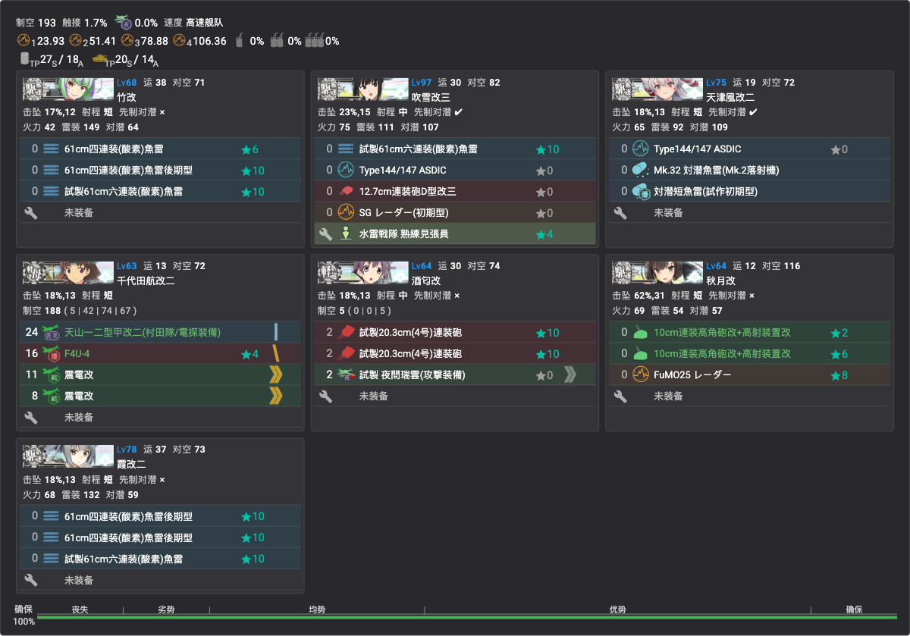

- **贴条**：同 B2 队（同一批船换装备）
- **编成**（对水上）：竹改、吹雪改三、霞改二（鱼雷 CI）、天津风改二（先制反潜）、千代田航改二、酒匂改（主炮连击）、秋月改——7 舰高速
- **路线**：**1（出发）→ A（无战斗）→ A2（空袭）→ B（能动）→ C（炸鱼）→ C1（炸鱼）→ C2（ム级）**
- **阵型**：A2 轮形 · C 警戒 · C1 警戒 · **C2 单纵**
- **敌编成（甲）**：ム级＋ヌ级或リ级＋ツ级＋后期ロ级×2（单纵）

#### 解谜编成：D2 点 S 胜（实战记录）
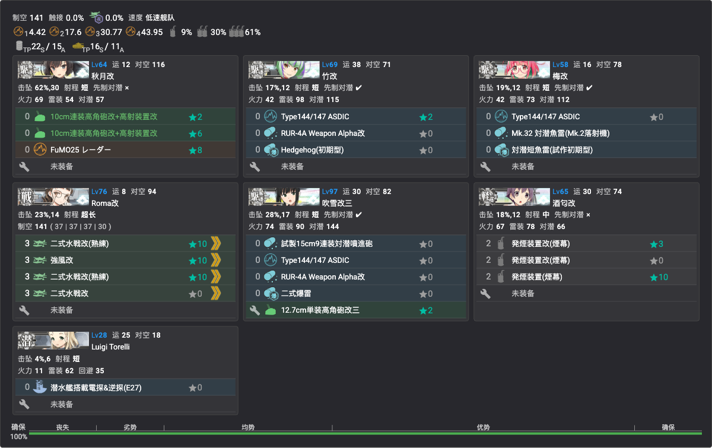

- **贴条**：三十一戦隊系（**Luigi Torelli 为本队新贴，01β**）
- **编成**：秋月改（对空 CI）、竹改、梅改（先制反潜）、**Roma改（全水战，制空 141）**、吹雪改三（反潜）、酒匂改（拉烟）、**Luigi Torelli（带路）**——7 舰低速
- **路线**：**1（出发）→ A（无战斗）→ A2（空袭）→ D（能动）→ D1（空袭&对潜）→ D2（潜水姬）**
- **阵型**：A2 轮形 · D1 轮形 · **D2 单横**
- **敌编成（甲）**：同 B2——潜水新棲姬バカンス＋潜水ヨ级×3（梯形）
- **拉烟**：**D1 点施放烟幕**（与 B1 同理，规避空袭&对潜混合点伤害）

#### 解谜编成：E2 点 S 胜（实战记录）
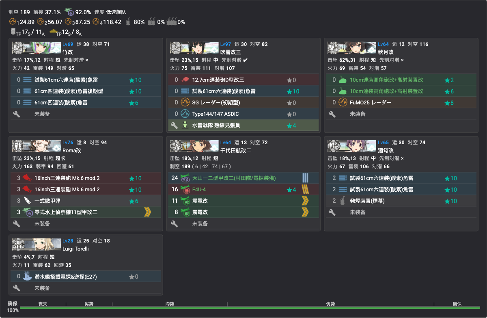

- **贴条**：三十一戦隊系（全员已贴，无新锁）
- **编成**：竹改（鱼雷 CI）、吹雪改三（见张员）、秋月改（对空 CI）、Roma改（主炮＋彻甲弹）、千代田航改二（舰攻＋战斗机）、酒匂改（鱼雷＋**拉烟**）、Luigi Torelli——7 舰低速
- **路线**：**1（出发）→ A（无战斗）→ A2（空袭）→ D（能动）→ E（炸鱼）→ E1（空袭）→ E2（軽巡新棲姬）**
- **阵型**：A2 轮形 · E 警戒 · E1 轮形 · **E2 单纵**
- **敌编成（甲）**：軽巡新棲姬＋ヌ级＋ツ级＋后期ロ级×2~3（单纵）
- **拉烟**：**E 点（炸鱼）施放烟幕**，规避敌潜先制雷击

## 各阶段攻略
### P1（攻坚）
- **boss**：O 点 深海擱座揚陸姬——**耐久 980**，装甲 222／斩杀段（-坏）282；随伴 削血段 空母夏姬Ⅱ＋重巡夏姬＋第二舰队ナ级Ⅱe；斩杀段 空母夏姬Ⅱ×2＋重巡夏姬×2＋ナ级Ⅱe×2
- **敌编成（甲，敌连合）**：主队另有ヌ级改×1~2＋リ级；第二舰队 ヘ级＋ツ级＋ナ级Ⅱe＋后期ロ级×2~3；**boss 制空**：削血段优势线 803／斩杀段优势线 932
- ✅ **已突破**（2026-07-14）

#### 攻坚编成（实战记录）
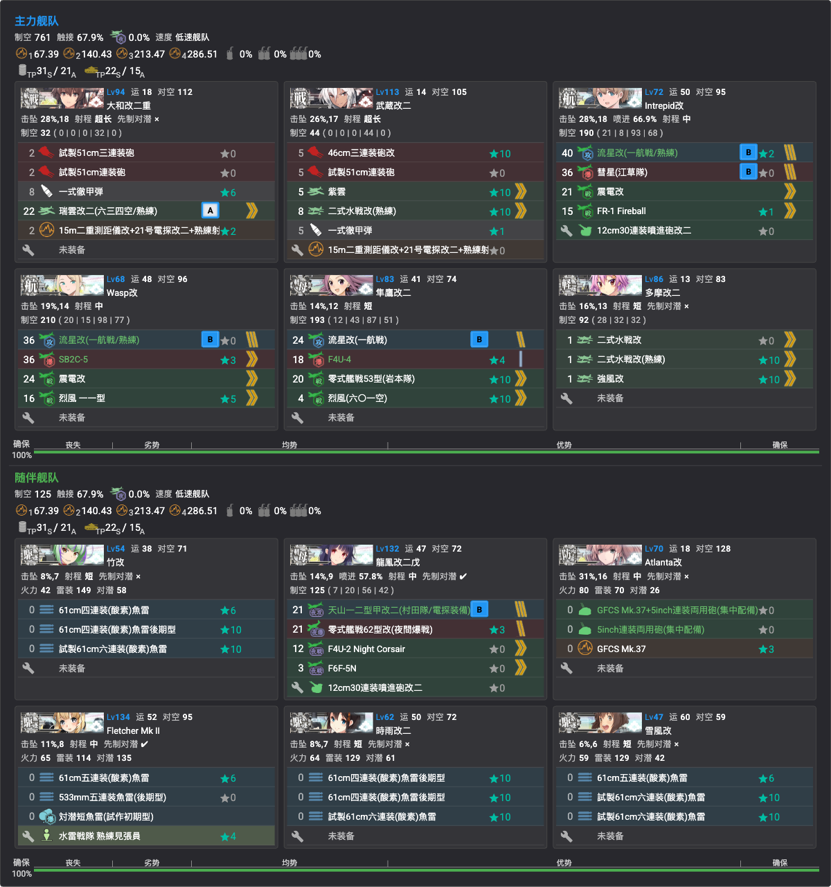

- **贴条**：「ウルシー攻撃部隊」（**新札**，本队 12 舰全员新贴——連合札的大和/武藏进不来，主力全部使用多号机，见[锁船表](../../00-活动总览/锁船表.md)）
- **编成**（低速连合，第二出发点，制空 761＋125）：
  - 主力：**大和改二重①**（主炮＋彻甲弹＋瑞云〔飞机A〕＋电探）、**武藏改二①**（主炮＋彻甲弹＋水侦/水战＋电探）、Intrepid改／Wasp改（攻击机＋战斗机）、隼鷹改二（全战斗机）、多摩改二（水战台）
  - 随伴：竹改②／時雨改二②／雪風改①（鱼雷 CI）、龍鳳改二戊（夜袭）、Atlanta改（对空 CI）、Fletcher Mk.II（先制反潜＋鱼雷 CI）
- **路线**：**2（出发）→ F（空气）→ A2（空袭）→ G（炸鱼）→ H（能动）→ I（ヲ级水面）→ J（空袭）→ L（ル级）→ O（boss）**
- **阵型**：A2 三阵 · G 一阵 · I 二阵 · J 三阵 · L 二阵 · **O 四阵（武大摸）**
- **基地航空队**：一队出击夺制空（二式大艇＋隼III型甲＋零战21熟练×2，半径9）；二队防空守家（試製震電×2＋試製秋水×2，制空 489）；三队待机

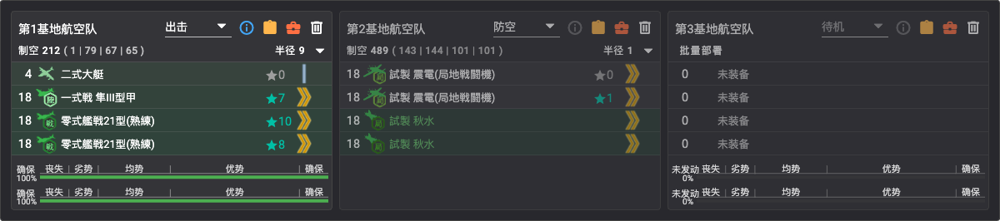

- **支援舰队**：斩杀时决战支援推荐

### P2（输送）
- **boss**：Q 点 重巡夏姬（**耐久 550**，低难度档 450；随伴有ネ改出现的编成模式，其余弱）
- **敌编成（甲）**：重巡夏姬＋ツ级＋后期ロ级×4（单纵）；强档以ネ改夏×1~2 替换驱逐
- **TP 总量**：1000（甲）
- ✅ **已突破**（2026-07-15）

#### 输送编成（实战记录）
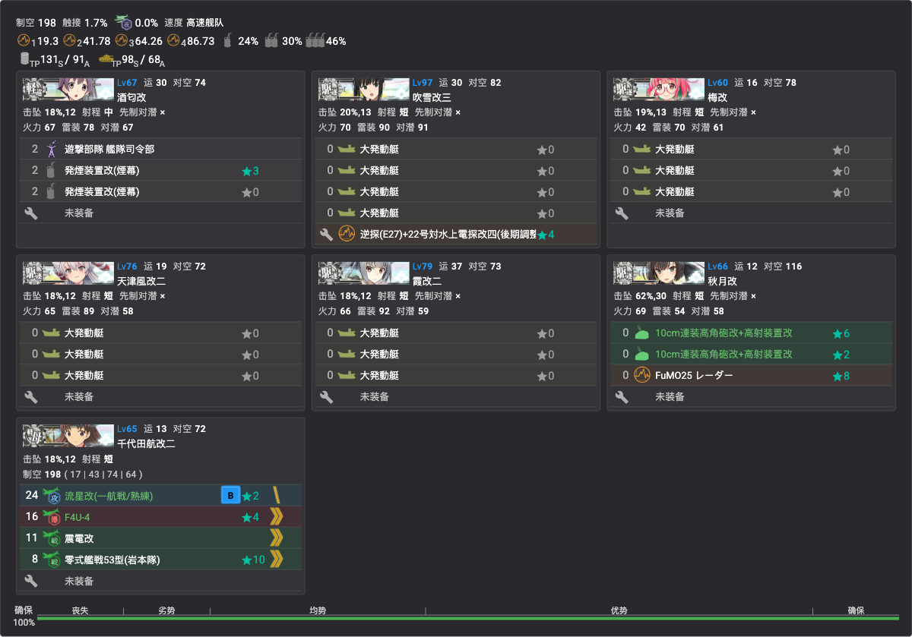

- **贴条**：三十一戦隊系（全员已贴，无新锁）
- **编成**（7 舰游击，高速，制空 198）：**酒匂改**（旗舰：**司令部退避**＋拉烟）、吹雪改三（大发×4＋电探，索敌担当）、梅改①／天津风改二／霞改二②（各大发×3）、秋月改④（对空 CI）、千代田航改二③（舰攻＋战斗机）
- **TP**：每趟 131(S) / 91(A)——**A 胜流，boss 点争取 A 胜即可**
- **路线**：**1（出发）→ A（空气）→ A2（空袭）→ B（能动）→ C（炸鱼）→ C2（ム级）→ P（揚陸点）→ Q（boss）**
- **阵型**：A2 轮形 · C 警戒 · C2 警戒 · **Q 警戒**
- **拉烟**：**C2 点施放烟幕**
- **索敌**：**系数 4 需 80 以上**（吹雪电探＋秋月 FuMO 补足）
- **基地航空队**：一队出击集中 boss（一式陆攻野中队＋一式陆攻＋银河江草队×2，半径8）；二队防空守家（試製震電×2＋試製秋水×2）；三队待机

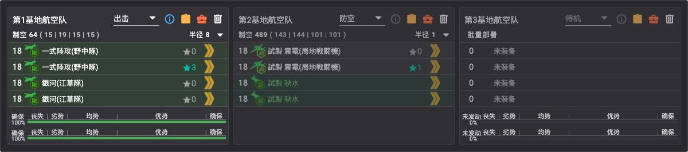

### P3（攻坚）
- **boss**：X 点 環礁空母泊地棲姬——**耐久 1000**（低难度档 900），斩杀段（-坏）装甲 245（随伴弱）
- **敌编成（甲，敌连合）**：削血段 泊地棲姬＋ワ级×3＋リ级×2（第二舰队 ツ级＋后期ハ级×5，**敌制空 0**）；斩杀段 -坏＋ヲ级×2＋ワ级×3——**优势线 309**
- ✅ **已突破**（2026-07-15）

#### 攻坚编成（实战记录）
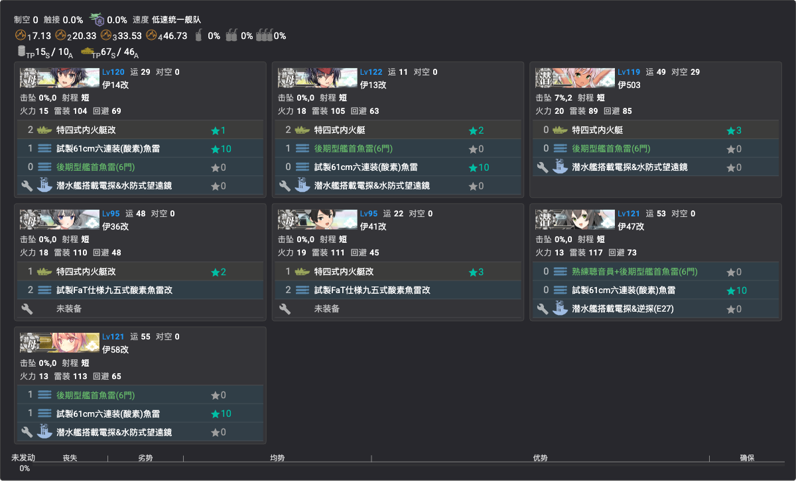

- **贴条**：「第六艦隊」（**新札**，7 艇全员新贴，见[锁船表](../../00-活动总览/锁船表.md)）
- **编成**（7 潜艇游击，低速）：伊14改／伊13改（特四内火艇×2＋鱼雷）、伊503（特四内火艇＋电探）、伊36改／伊41改（特四内火艇改＋FaT 鱼雷）、伊47改／伊58改（雷击特化）——全队大量搭载**特四式内火艇**（环礁泊地特殊攻击关联）
- **路线**：**3（出发）→ R（空气）→ S（DD 水雷）→ T（空袭）→ V（重巡水雷）→ X（boss）**
- **阵型**：S 单纵 · T 轮形 · V 单纵 · **X 单纵**
- **支援舰队**：道中支援推荐；**斩杀时关底支援推荐**
- **基地航空队**：双队出击集中 boss——一队诱导弹特化（二式大艇＋四式重爆飛龍イ号一型甲★4＋Do 217 K-2 Fritz-X×2，半径7），二队陆攻银河（野中队×2＋江草队×2，半径8）；三队防空守家（試製震電×2＋試製秋水×2）

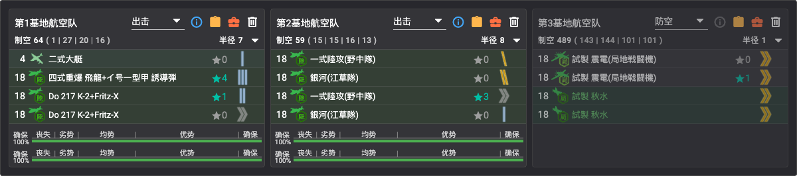

### 解谜：削甲（P4 斩杀前）
> 效果（Z 点装甲削减）：層間棲艦水鬼次女 **-55** · 高速軽空母首鬼 **-45** · 軽母ヌ級elite(2310)/軽巡ヘ級(改)flagship/重巡ネ級改(II)夏mode/空母夏姫II **-25**
> 「S?」＝胜利等级待确认（可能 A 胜即可）

| 条件 | 次数 | 编成 |
|------|------|------|
| W 点 S?胜 | ×1 | 专用游击队（见下） |
| E2 点 A 胜 | ×1 | 照抄 [E2 点解谜编成](#解谜编成e2-点-s-胜实战记录) |
| Y3 点 S?胜 | ×1 | 专用连合（见下） |
| O 点（P1 boss）A 胜 | ×2 | 照抄 [P1 攻坚编成](#p1攻坚) |
| Q 点（P2 boss）A胜 | ×2 | 照抄 [P2 输送编成](#p2输送) |
| X 点（P3 boss）A胜 | ×2 | 照抄 [P3 攻坚编成](#p3攻坚) |
| 基地（防空）优势 | ×3 | 一队陆航防空守家，出击时自动达成 |

- **解除判定**：Z 点 boss 立绘颜色由**橙转红**即削甲完成

> 💡 一队守家只到**空均**时可派**两队守家**——削甲只要求 A 胜的点位不强求陆航输出。
> ✅ 削甲全部完成（2026-07-18 斩杀前）。

#### 削甲编成：W 点（实战记录）
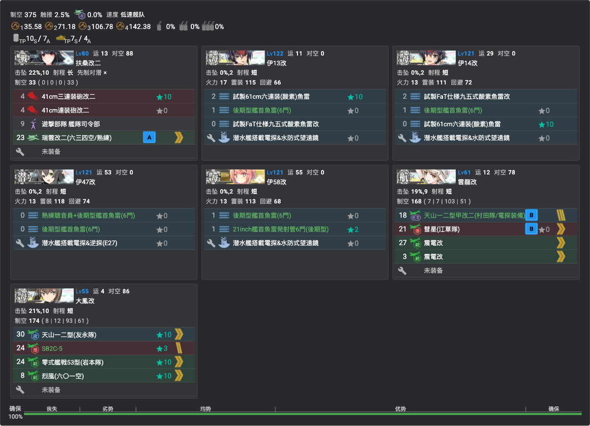

- **贴条**：「第六艦隊」（**扶桑改二／云龙改／大凤改为本队新贴**；潜艇沿用 P3 队）
- **编成**（7 舰游击，低速，制空 375）：**扶桑改二**（旗舰：司令部＋主炮＋瑞云）、伊13改／伊14改／伊47改／伊58改（鱼雷特化）、**云龙改**／**大凤改**（攻击机＋战斗机）
- **路线**：**3（出发）→ N（ム级）→ R（空气）→ S（水雷）→ T（空袭）→ U（空袭）→ V（水雷）→ W（ネ改，330 血）**
- **阵型**：N 单纵 · S 单纵 · T 轮形 · U 轮形 · V 单纵 · **W 单纵**
- **敌编成（甲）**：ネ改夏＋ヘ级＋ツ级＋后期驱逐×3（单横/复纵）

#### 削甲编成：Y3 点（实战记录）
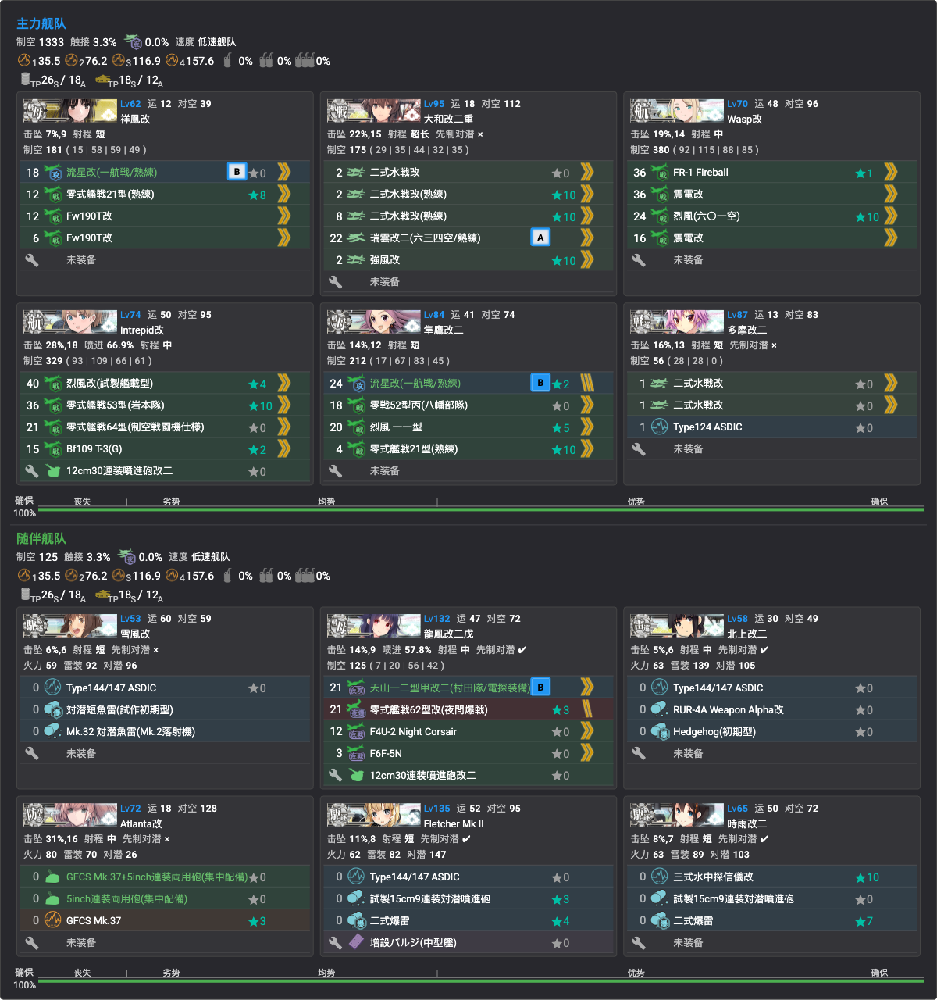

- **贴条**：「ウルシー攻撃部隊」（**祥凤改为本队新贴**，其余沿用 P1/P4 队）
- **编成**（低速连合，制空 1333＋125，对空&对潜特化）：
  - 主力：**祥凤改**（舰攻＋战斗机）、大和改二重①（全水战＋瑞云）、Wasp改／Intrepid改（全战斗机）、隼鹰改二、多摩改二（水战＋水听）
  - 随伴：雪风改①／时雨改二②／Fletcher Mk.II／**北上改二①**（对潜特化）、龙凤改二戊（夜袭）、Atlanta改（对空 CI）
- **路线**：**2（出发）→ F（空气）→ A2（空袭）→ G（炸鱼）→ H（能动）→ M（空袭）→ Y1（炸鱼）→ U（空袭）→ Y2（空袭）→ Y3（空袭&对潜）**
- **阵型**：空袭（A2/M/U/Y2）三阵 · 对潜（G/Y1/**Y3**）一阵
- **敌编成（甲）**：Y3 潜水ソ级×3＋ヌ级×2（梯形）；**空优线 329**

### P4（攻坚）/ 斩杀（ラスダン）
- **boss**：Z 点 **高速軽空母首鬼《新》**——耐久 1150，装甲 削血段 245 / 斩杀段（-坏）295
- **随伴**：削血段 層間棲艦水鬼**次女**＋空母夏姬Ⅱ＋ネ改＋第二舰队ナ级Ⅱe；斩杀段 夏姬Ⅱ与ネ改分身、第二舰队ナ级Ⅱe 再+1
- **boss 制空（甲）**：削血段优势线 804；斩杀段优势线 1014／确保 2028
- ✅ **已击破**（2026-07-18，削甲后斩杀，**E3 甲全通关＝前段作战全甲**）

#### 攻坚/斩杀编成（实战记录）
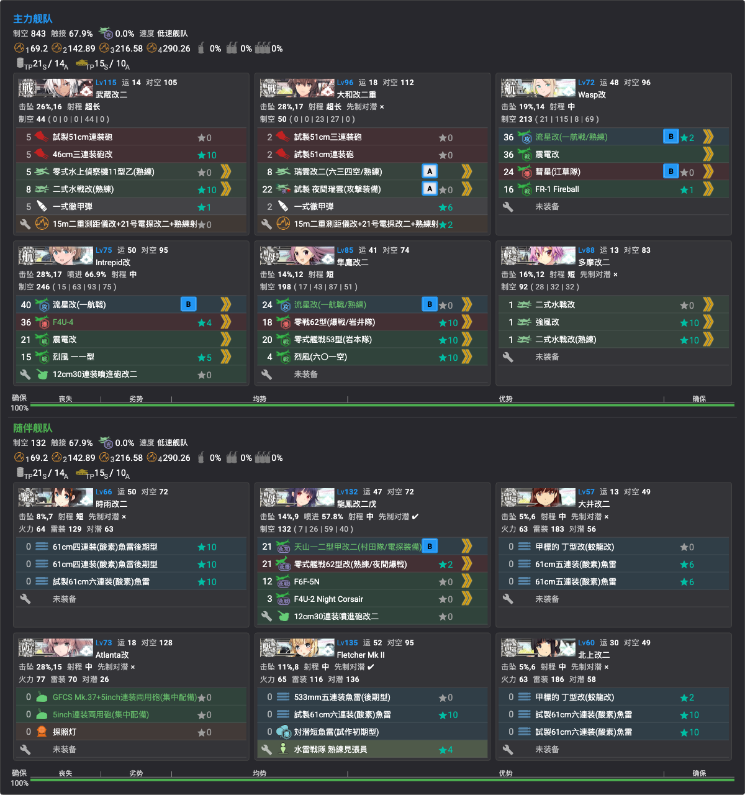

- **贴条**：「ウルシー攻撃部隊」（**北上改二①／大井改二②为本队新贴**——連合札的北上②/大井①进不来；其余沿用 P1 队）
- **编成**（低速连合，第二出发点，制空 843＋132）：
  - 主力：**武藏改二①**（主炮＋彻甲弹＋水侦/水战＋电探）、**大和改二重①**（主炮＋彻甲弹＋**瑞云×2〔飞机A〕**＋电探）、Wasp改／Intrepid改（攻击机＋战斗机）、隼鷹改二（舰攻＋战斗机）、多摩改二（水战台）
  - 随伴：時雨改二②（鱼雷 CI）、龍鳳改二戊（夜袭）、**大井改二②**／北上改二①（甲标的，开幕雷击）、Atlanta改（对空 CI＋探照灯）、Fletcher Mk.II（鱼雷 CI＋对潜）
- **路线**：**2（出发）→ F（空气）→ A2（空袭）→ G（炸鱼）→ H（能动）→ M（空袭）→ Y1（炸鱼）→ U（空袭）→ Y2（空袭）→ Y（タ级战舰，「塔」）→ Z（boss）**
- **阵型**：A2 三阵 · G 一阵 · M 三阵 · Y1 一阵 · U 三阵 · Y2 三阵 · Y 二阵 · **Z 四阵（武大摸）**
- **基地航空队**：一队攻击「神风」（一式陆攻野中队×2＋银河江草队×2，半径8）；二队制空「空劣」（二式大艇＋隼III型甲＋四式战疾风＋试制烈风后期型，制空 231，半径8）；三队防空守家（震电×2＋秋水×2，制空 489）

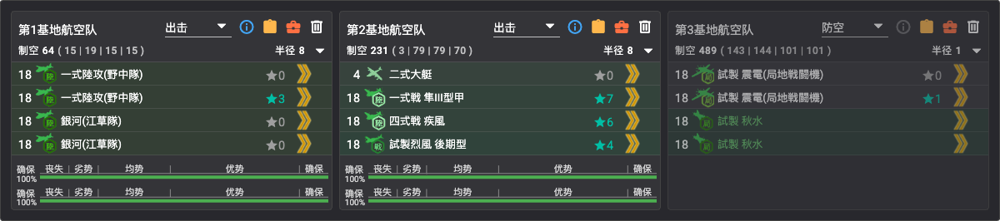

- **支援舰队**：斩杀时决战支援**必要**
- 友军：击破时**尚未实装**（未等友军直接通关）

### 突破奖励
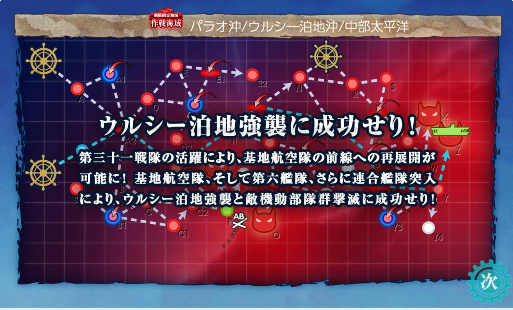

- 勋章×3、改修资材×8、補強増設
- 二选一：洋上補給×6 或 海外舰最新技术×3
- XF5U★+1、TBF★+7、61cm四連装(酸素)魚雷五型改三★+8
- **轻空母 Independence**（通关合流，可改装夜战轻空母）

## 掉落
实测（甲）：
| 点位 | 掉落 |
|------|------|
| O（P1 boss） | 日進 |
| I | 伊26 |
| L | **伊401**、平安丸 |
| Q（P2 boss） | 伊26 |
| X（P3 boss） | 伊26 |
| Z（P4 boss） | **伊14** |
| Y | **伊400**、Langley |

TsunDB（甲）：**大鳳** L/O/Q/X/Y 点（均 S 限）；**伊13/Iowa/Wasp/Intrepid/Lexington/Saratoga** 集中在 **Z 点**（P4 boss）；第百一号輸送艦 O/Q/X 点（S 限）——掉率详见[掉落一览](../../03-捞船/掉落一览.md)
