# E4 地中海南仏沖/アルジェリア沖/イタリア半島沖

> ✅ **E4 甲通关**（2026-07-21，P1~P5 全破，削甲后斩杀）。

> **海域**：[E1](../E1/概览.md) · [E2](../E2/概览.md) · [E3](../E3/概览.md) · **E4** · [E5](../E5/概览.md)
> **阶段**：[地图](#地图) · [带路条件](#带路条件分歧点) · [P1（攻坚）](#p1攻坚boss-d-点) · [解谜·开P2boss](#解谜开-p2-boss) · [P2（输送）](#p2输送boss-n-点) · [P3（攻坚）](#p3攻坚boss-s-点) · [P4（攻坚）](#p4攻坚boss-x-点) · [削甲](#解谜削甲p5-斩杀前) · [P5/斩杀](#p5攻坚斩杀) · [突破奖励](#突破奖励)

## 基本信息
- **作战名**：【Opération Vado -ヴァード作戦-】（瓦多作战）
- **札**：**「仏第3艦隊」[7]「仏地中海艦隊」[8]**（实测：**P1/P2=仏第3艦隊**；kcwiki：P3/P4/P5=仏地中海艦隊）
- **阶段**：**五条血条**——**攻坚P1 ✅ → 输送P2 ✅ → 攻坚P3 ✅ → 攻坚P4 ✅ → 削甲 ✅ → 斩杀P5 ✅**（2026-07-21 **甲通关**）；对应官推流程 ①强袭意北 → ②脱出阿尔及利亚再编 → ③输送后展开基地航空队反击
- **解锁条件**：前段作战（E1~E3）全部突破

## 地图
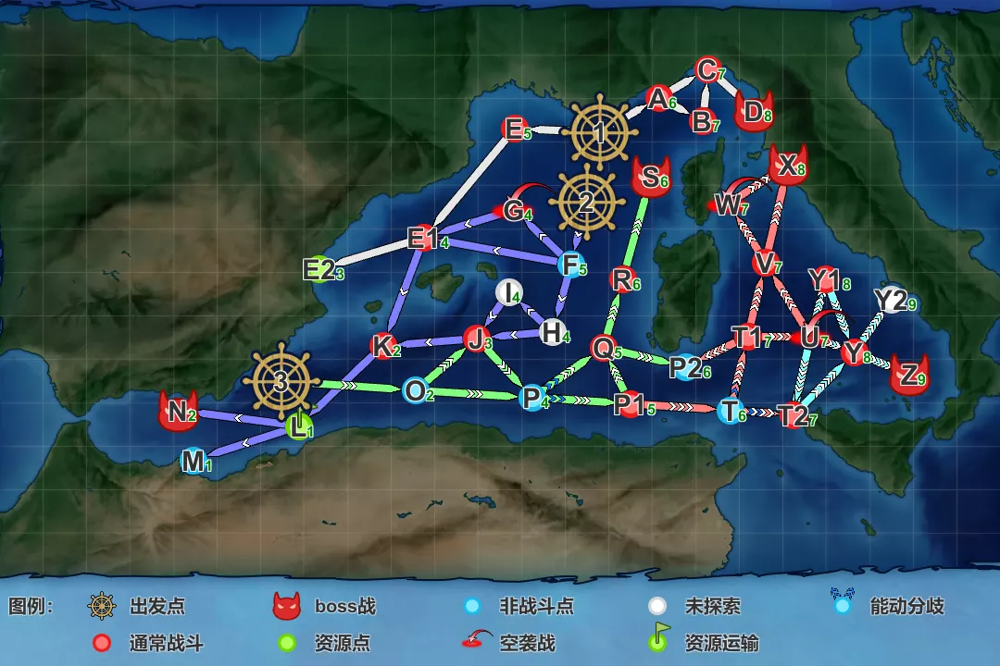

- **出发点×3**：①右上（利古里亚海，意北强袭＝P1）、②①西南侧、③左下（阿尔及利亚方面）
- **boss 点**：**D**（P1，右上意北）；另有 N/S/X/Y/Z 等 boss 位，后续血条对应待开图
- 中部绿色资源运输线（O~Q/P1/P2、R~S 一带）与输送段相关

## 路线与机制
- **出发点×3**（带路贴初版）：单舰队→①；连合舰队：开②未开③时→②；开③后**输送部队／AO+LHA+AV≥2／AO+LHA+AV+AS≥3→②**，其余连合→③
- **札**（带路贴编号 [7]/[8]，与札名对应待确认）：①②出发贴 [7]，③出发贴 [8]——推测 [7]=仏第3艦隊、[8]=仏地中海艦隊
- 关键机制：**P2 击破后开放基地航空队**（实测 2026-07-19，对应官推「输送成功后展开基地航空队」）

### 带路条件（分歧点）
> 以下均为 **TsunDB 实测数据推断**（甲），非检证结论：
> - **1→A/E**：**CA系≥2 → A**（P1 攻坚正路）；无重巡系的轻编成/狗粮队 → E（解谜路线）
> - **A→B/C**：**AV≥1 → B**；其余 → C（P1 正路）
> - **F→G/H/E1**（②出发）：**BB系+CV系≥1 → G**；其余 → E1（P2 输送正路；带 AV 不受影响）
> - **E1→E2/K**：**单舰队 → E2**（解谜到达点）；**连合 → K**（P2 正路）
> - **L→M/N**：走 M 的样本与走 N 同构成且极少——**疑似 L→N 索敌判定**（线未测）
> - **O→P/J**（③出发后首个分歧）：走 **P** 需 **CV+CVB≤1 且 BB系≤2**（本队 FBB2＋CV1＋CVL2、随伴 DD3 实测可过）；**CV+CVB≥2 或 BB系≥3 → J**。个别带 AO 或 CA系≥3 的编成有弹 J 孤例，条件待确认。
> - **P、T 均为能动分歧**（P 选 P1/Q 方向、T 选 T1/T2 方向）；P1→T 固定
> - **T1→U/V**：**高速→U，低速→V**（各 200+ 样本零例外）——**P4 路线必须低速连合**
> - **V→W/X**（P4 boss 前）：**BBV（航战）≥1 → W**；**带 CV+CVB 时随伴需凑到全队 DD≥5**，否则弹 W（CV=0 时 DD4 亦可过）；无同构成重叠样本，判定为纯编成分流、无索敌门
>
> - **U 分歧（U→V/Y1/Y/T2）**：**高速→Y**（P5 boss 方向，300 样本主流）；低速/带 BBV/AV 的编成散去 V/Y1；有极少量与 Y 同构成的样本被弹 T2——**疑似 U 处有索敌判定**，堆好索敌保险
> - **Y→Z**：甲 328 个样本全部直进 Z，未见 Y2 弹点记录（Y2 疑为索敌沟/低难度点）
>
> **P4 最短路（3-O-P-P1-T-T1-V-X）编成要求汇总**：低速连合＋BB系≤2（**不能用航战**）＋CV+CVB≤1（带正空则总 DD≥5）＋CVL 不限（CV系3 实测可过 O→P）。
> **P5 最短路（3-O-P-P1-T-T1-U-Y-Z）编成要求汇总**：**高速连合**＋CV+CVB≤1 且 BB系≤2（同 O→P 限制）——主流样本配置＝FBB×2＋CV×1＋CVL×2＋CA系/CL（随伴 DD4），**与 P3 的 Richelieu 高速队同构**，P3 队伍可直接沿用打 P5；P4/P5 靠 T1 的航速分流。

> ⚠️ **锁船注意**：官推点名 Mogador、Roma 可在本海域邂逅，大概率是特效候补；但本队 **Mogador改③（误锁）与 Roma改② 均已贴 01β**——前段札能否进后段待确认，别指望直接投入，必要时用二号机。

## 特效（倍卡）
> 倍率数据见 [2026夏活检证情报文档](https://docs.google.com/document/d/1cJ66SdOAH_EIerB3OuGH05lXk7bTl45VGlwbYZRCqDg/edit?tab=t.0)

检证（2026-07-20 更新）：
- **全图舰种**：DD 1.04 · CL 1.06 · AV 1.08
- **国籍**：意 **1.19** · 英 **1.15** · 德 1.08 · 美 1.06 · 苏 1.06 · 瑞 1.06（法 待检证）
- **单独舰**：足柄 1.11 · **Mogador 1.66？· Gloire 1.64？· Richelieu 1.7？· Jean Bart 1.77？**（法舰特大倍卡，待确认）· Zara 1.06？· Pola 1.08？· Warspite 1.07？· Ark Royal 1.11？· Glorious 1.05？
- **舰载机**（欧洲分级表体系）：A1 1.06 · A2 1.05 · A3 1.04
- **对地装备组**：A组＝特大发+III号J型／大发(R35&法兵)／チハ改／陆战队+チハ改；B组＝特大发+III号(北非)／特大发+一式炮战车／特四内火艇改／M4A1DD／チハ；C组＝大发(II号北非)／特大发チハ/チハ改/战车11连队／特二·特四内火艇／陆军步兵／阻塞气球／14inch连装·三连装炮
- **点位追加**：
  - **P1 boss D**：DD 1.06 · CA 1.13 · CAV 1.06 · 舰载机 A1 1.04／A2 1.03／A3 1.03／B2 1.04／B3 1.07／B4 1.04 · **装备A 1.12／B 1.08／C 1.04**
  - **P3 boss S**：DD 1.07？· CA 1.11？· CAV 1.07？· 舰载机 A1 1.05？／A2 1.04？／A3 1.03？／B1 1.06？／B2 1.03？／B3 1.06？／B4 1.03？
  - **P4 boss X**：装备A 1.12／B 1.08／C 1.04
  - **P5 boss Z**：DD 1.15 · CA 1.25 · CAV 1.15 · AV？· 舰载机？

## 各阶段攻略
### P1（攻坚，boss D 点）
- ✅ **已击破**（2026-07-19）
- **boss**：D 点 **集積地棲姫II バカンスmode**（用户称「DJ」）——**耐久 4800**（甲；道中 C 点同型 3200 档），对地战
- **敌编成（甲）**：A 后期驱逐×4＋Schnellboot小鬼群×2；C 集积地棲姬II＋トーチカ小鬼×2＋后期ハ级＋Schnellboot×2（复纵，空优线 69）；D 集积地棲姬II＋トーチカ小鬼×2＋対空小鬼或ネ改II夏＋Schnellboot×2（复纵，空优线 74）

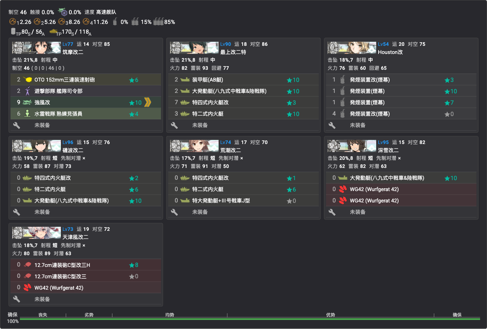

- **贴条**：「仏第3艦隊」（第一出发点；7 舰全员新贴，见[锁船表](../../00-活动总览/锁船表.md)）
- **编成**（7 舰游击，高速，制空 46）：筑摩改二（旗舰：**司令部退避**＋水战）、最上改二特（对地满配：装甲艇＋大发战车＋内火艇）、Houston改（**拉烟**：发烟×4）、矶波改二／荒潮改二（内火艇对地）、深雪改二（大发战车＋WG42）、天津风改二（连击＋WG42）
- **路线**：**1（出发）→ A（驱逐）→ C（集积地）→ D（boss）**
- **阵型**：A 警戒 · C 警戒 · **D 单纵**
- 💡 **C 点拉烟**（Houston 发烟×4）

### 解谜：开 P2 boss
> ✅ 已完成（2026-07-19）。检证文档口径为「E2 点 S 胜×1？（可在 P1 期间顺路做）」——E2 为无战斗点，到达即算。

| 条件 | 次数 |
|------|------|
| E2 点到达 | ×1 |

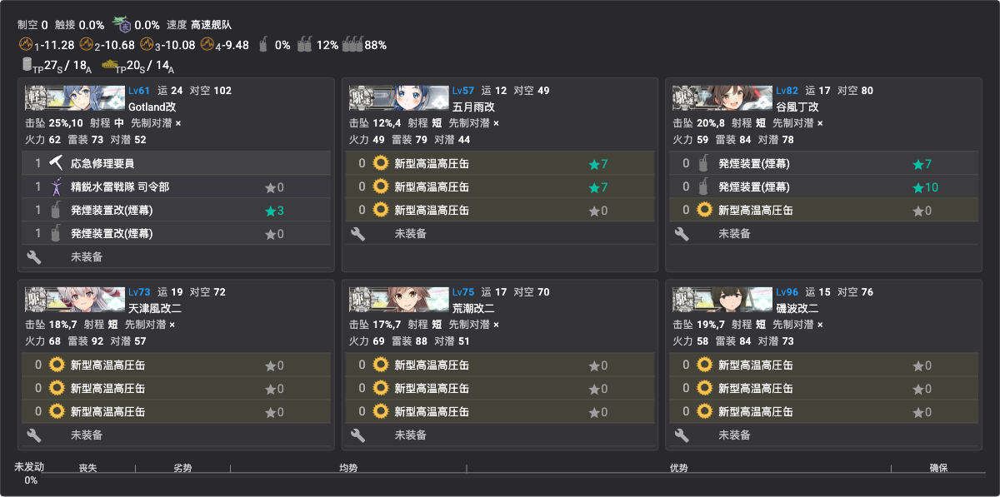

- **编成**（6 舰高速，**全员沿用 [7] 队、无新锁**）：Gotland改（旗舰：**司令部退避**＋损管＋拉烟）、谷风丁改（拉烟＋高压缶）、五月雨改／天津风改二／荒潮改二／磯波改二（各高压缶×3）
- **路线**：**1（出发）→ E（水雷）→ E1（水雷）→ E2（资源点）**
- **阵型**：E 警戒 · E1 警戒
- 💡 **E1 点拉烟**（Gotland＋谷风发烟）
- **敌编成（甲）**：E 后期驱逐×4＋Schnellboot小鬼群×2；E1 **ネ级**＋后期驱逐×4＋Schnellboot——危险源在 E1
- 💡 削甲条件之一「E2 点到达×2」同走此路线

### P2（输送，boss N 点）
- ✅ **已击破**（2026-07-19）
- **boss**：N 点 **戦艦仏棲姫 バカンスmode**——**耐久 770**
- **敌编成（甲）**：N 仏棲姬＋ヌ级改或ツ级＋后期ハ级×4（单纵，优势线 101~260）；道中 K ル级×2＋后期ハ级×4

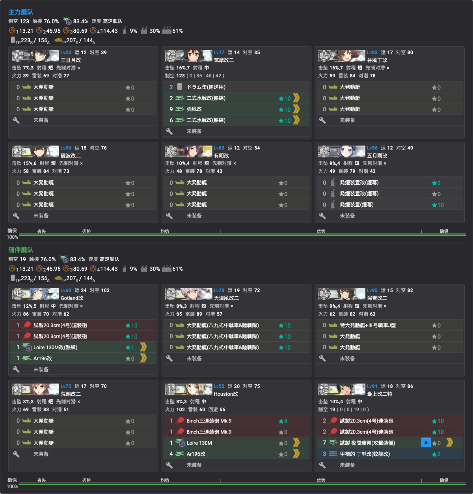

- **贴条**：「仏第3艦隊」（第二出发点，输送连合；**三日月改②/谷风丁改/有明改/五月雨改/Gotland改为本队新贴**，其余沿用 P1 队）
- **编成**（高速输送连合，制空 123＋19，TP 每趟 223(S)/156(A)）：
  - 主力：三日月改②／谷风丁改／磯波改二／有明改（各大发×3）、筑摩改二（水战台＋桶）、五月雨改（**拉烟**：发烟×3）
  - 随伴：Gotland改／Houston改（主炮＋水侦）、天津风改二（大发战车）、深雪改二／荒潮改二（大发）、最上改二特（夜间瑞云＋甲标的）
- **路线**：**2（出发）→ F（无战斗）→ E1（水雷）→ K（ル级，「撸」）→ L（揚陸点）→ N（boss）**
- **阵型**：E1 警戒 · K 警戒 · **N 单纵**
- 💡 **K 点拉烟**（五月雨发烟×3）
- **P2 击破后开放基地航空队**（P3 起可用）

### P3（攻坚，boss S 点）
- ✅ **已击破**（2026-07-19）
- **boss**：S 点 **深海地中海棲姫 バカンスmode**（用户称「地中海姬」）——**耐久 790**，装甲 258／斩杀段（-坏）298（敌连合）
- **敌编成（甲）**：削血段 地中海姬＋空母夏姬Ⅱ＋**戦艦棲姫×2**＋ネ改II夏＋ツ级（随伴 ヘ级改＋ナ级Ⅱe＋后期ハ级×4）——优势线 315；斩杀段 -坏＋空母夏姬Ⅱ×2＋戦艦棲姫×2＋ネ改II夏——**优势线 630**
- **道中**：Q 水雷混潜艇（リ级＋ヌ级改＋后期ハ级×3＋**潜水ソ级**，优势线 161）；R「塔姐」＝**タ级战舰×2**＋ツ级＋后期ハ级×3

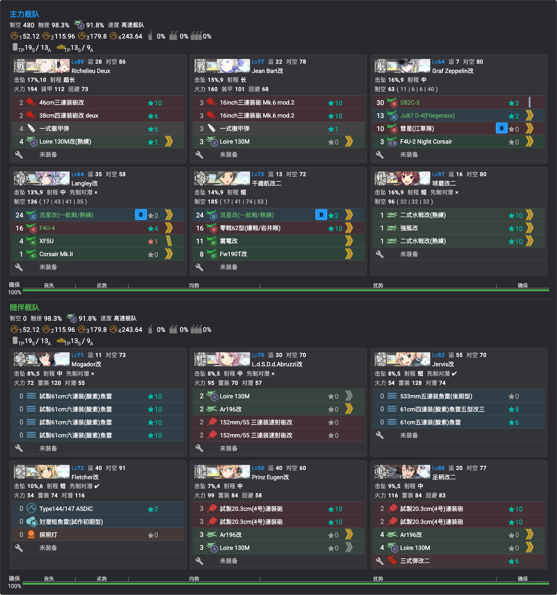

- **贴条**：「仏地中海艦隊」[8]（**第三出发点，12 舰全员新贴**，见[锁船表](../../00-活动总览/锁船表.md)）
- **编成**（高速空母机动连合，制空 480）：
  - 主力：**Richelieu Deux**／**Jean Bart改**（主炮＋彻甲弹＋水侦）、Graf Zeppelin改（攻击机＋夜战机）、Langley改／千岁航改二②（攻击机＋战斗机）、球磨改二（水战台）
  - 随伴：Mogador改①／Jervis改（鱼雷 CI）、Abruzzi改／Prinz Eugen改（主炮水侦）、Fletcher改②（对潜＋探照灯）、足柄改二（主炮＋三式弹）
- **路线**：**3（出发）→ O（无战斗）→ P（能动）→ Q（水雷混潜艇）→ R（塔姐）→ S（boss）**
- **阵型**：Q 一阵 · R 四阵 · **S 二阵（发动 Richelieu 特殊攻击）**——💡 除大和系特殊攻击用四阵外，**其余特殊攻击均为二阵发动**
- **基地航空队**：一队出击（隼III甲＋零战21熟练＋银河江草队＋B-25，制空 181，半径6）；二队出击（二式陆侦＋疾风＋**Do 217 K-2+Fritz-X×2 诱导弹**，制空 149×1.15，半径6）；三队防空守家（震电×2＋秋水×2，制空 489）

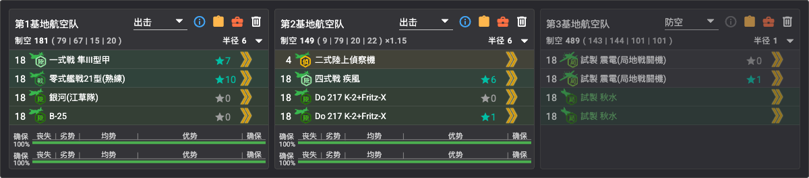

- **支援舰队**：斩杀时关底（决战）支援**必要**

### P4（攻坚，boss X 点）
- ✅ **已击破**（2026-07-20）
- **boss**：X 点 **港湾夏姬II**——**耐久 1550**，装甲 220／斩杀段（-坏）240（敌连合，随伴**集积地棲姬II**＋トーチカ小鬼——对地战）
- **敌编成（甲）**：削血段 港湾夏姬II＋集积地棲姬II＋トーチカ＋ヌ级II＋ネ改II夏＋ツ级（随伴 ヘ级改＋揚陸中ワ级II＋后期ハ级×2＋Schnellboot×2）——优势线 470；斩杀段 港湾/集积双-坏＋ネ改II夏×2——优势线 396
- **道中**：P1 水雷混潜艇（リ级＋ヌ级改＋后期ハ级×3＋潜水ソ级）；T1 炸鱼（潜水ソ级×4）；V **重巡夏姬**（耐久 450，＋ヲ级改II＋リ级，优势线 270~296）

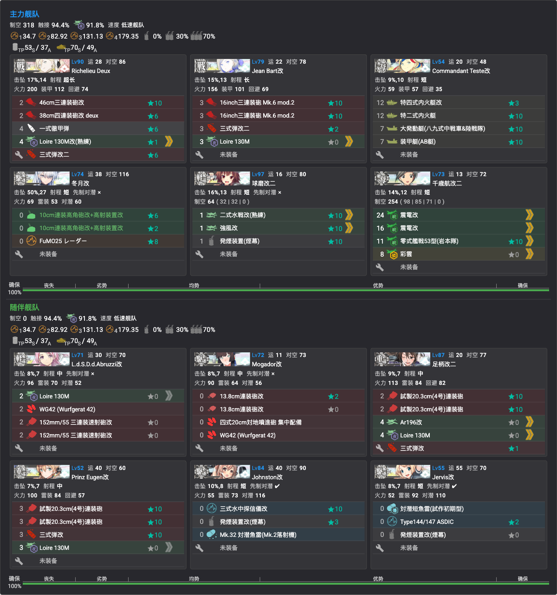

- **贴条**：「仏地中海艦隊」[8]（**Commandant Teste改／冬月改／Johnston改为本队新贴**，其余沿用 P3 队）
- **编成**（**低速**连合，制空 318）：
  - 主力：Richelieu Deux／Jean Bart改（主炮＋彻甲弹/三式弹）、**Commandant Teste改**（对地满配：内火艇系×2＋大发战车＋装甲艇）、冬月改（对空 CI＋电探）、球磨改二（水战＋拉烟）、千岁航改二②（全战斗机＋彩云）
  - 随伴：Abruzzi改／Mogador改①（对地：WG42/对地喷进炮）、足柄改二／Prinz Eugen改（主炮＋三式弹）、Johnston改／Jervis改（对潜＋拉烟）
- **路线**：**3（出发）→ O（无战斗）→ P（能动）→ P1（水雷混潜艇）→ T（能动）→ T1（炸鱼）→ V（重巡夏姬）→ X（boss）**
- **阵型**：P1 一阵 · T1 一阵 · **V 四阵** · **X 二阵（发动 Richelieu 特攻）**
- 💡 **V 点拉烟**（球磨＋Johnston＋Jervis 发烟）
- **基地航空队**：一队出击（二式大艇＋疾风＋**飛龍+イ号一型甲诱导弹**＋B-25，制空 129，半径8）；二队出击（PBY-5A＋隼III甲＋银河江草队＋B-25，制空 115，半径8）；三队防空守家（震电×2＋秋水×2，制空 489）

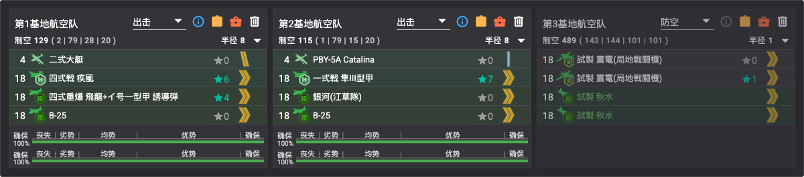

### 解谜：削甲（P5 斩杀前）
> 效果数值待检证（检证文档 2026-07-20 版尚未给出削减量）。

| 条件 | 次数 | 编成 | 状态 |
|------|------|------|------|
| E2 点到达 | ×2 | 照抄 [E2 解谜编成](#解谜开-p2-boss) | ✅ |
| T1 点 S 胜 | ×1 | [Y1 削甲编成](#削甲y1-点实战记录)顺路（对潜特化） | ✅ |
| U 点航空优势 | ×1 | [Y1 削甲编成](#削甲y1-点实战记录)顺路（制空 723） | ✅ |
| Y 点 S 胜 | ×2 | 照抄 [P3 攻坚编成](#p3攻坚boss-s-点)（高速队走 U-Y，即 P5 路线） | ✅ |
| Y1 点 S 胜 | ×2 | 专用低速连合（见下） | ✅ |
| D 点（P1 boss）S 胜 | ×2 | 照抄 [P1 攻坚编成](#p1攻坚boss-d-点) | ✅ |
| N 点（P2 boss）S 胜 | ×2 | 照抄 [P2 输送编成](#p2输送boss-n-点) | ✅ |
| S 点（P3 boss）A 胜 | ×2 | 照抄 [P3 攻坚编成](#p3攻坚boss-s-点) | ✅ |
| X 点（P4 boss）A 胜 | ×2 | 照抄 [P4 攻坚编成](#p4攻坚boss-x-点) | ✅ |
| 基地（防空）优势 | ×2 | 一队陆航防空守家，出击时自动达成 | ✅ |

> ✅ **削甲全部完成**（2026-07-21，斩杀前）。解除判定按惯例为 boss 立绘**橙转红**。

#### 削甲：Y1 点（实战记录）
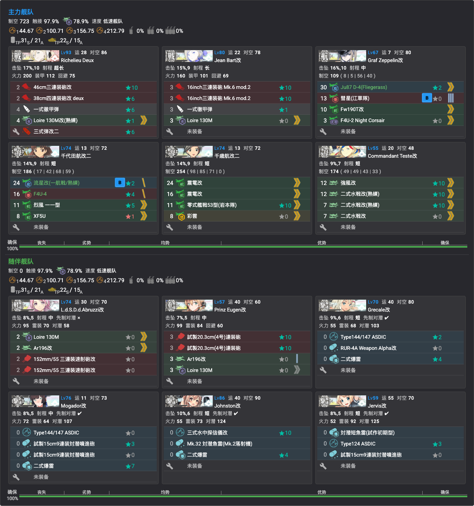

- **Y1 敌编成（甲）**：**潜水新棲姬 バカンスmode**（耐久 388）＋潜水ソ级×3（梯形/单横）；道中 U 为**飞行场姬×3~4 空袭点**（优势线 267~330）
- **贴条**：「仏地中海艦隊」[8]（**千代田航改二①／Grecale改为本队新贴**，其余沿用）
- **编成**（低速连合，对空&对潜特化，制空 723）：
  - 主力：Richelieu Deux／Jean Bart改（主炮＋彻甲弹/三式弹）、Graf Zeppelin改／千代田航改二①／千岁航改二②（攻击机＋战斗机）、Commandant Teste改（全水战）
  - 随伴：Abruzzi改／Prinz Eugen改（主炮水侦）、Grecale改／Mogador改①／Johnston改／Jervis改（对潜特化）
- **路线**：**3（出发）→ O（无战斗）→ P（能动）→ P1（水雷混潜艇）→ T（能动）→ T1（炸鱼）→ U（空袭）→ Y1（潜水姬）**
- **阵型**：P1 一阵 · T1 一阵 · **U 三阵** · **Y1 一阵**

### P5（攻坚/斩杀，boss Z 点）
- ✅ **已击破**（2026-07-21，削甲后斩杀，**E4 甲通关**）
- **boss**：Z 点 **仏蘭西哀重姬**——**耐久 1200**，装甲 255／斩杀段（-坏）285（敌连合）
- **敌编成（甲）**：削血段 哀重姬＋ヌ级II×2＋**深海地中海棲姬×2**＋ツ级（随伴 ム级＋ナ级Ⅱe×2＋后期ハ级×3）——优势线 504；斩杀段 -坏＋空母夏姬Ⅱ＋ヌ级II×2＋地中海姬-坏×2——**优势线 819**
- **道中**：Y 点 ネ改夏（耐久 390）——**斩杀期变ネ改II夏（470）**

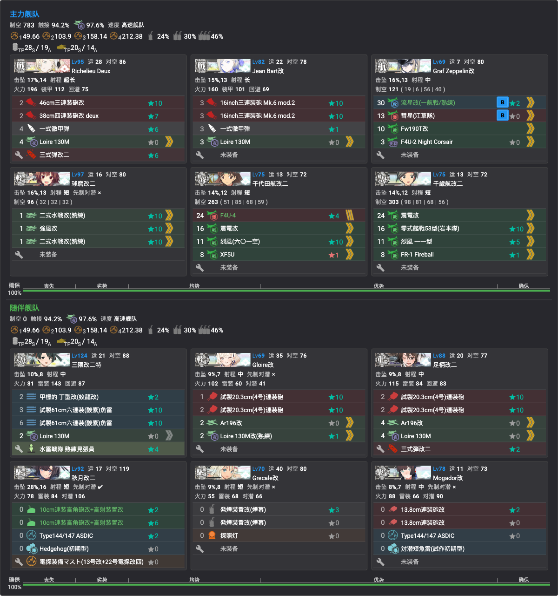

- **贴条**：「仏地中海艦隊」[8]（**三隈改二特①／Gloire改／秋月改二①为本队新贴**，其余沿用）
- **编成**（高速连合，制空 783）：
  - 主力：Richelieu Deux／Jean Bart改（主炮＋彻甲弹＋三式弹/水侦）、Graf Zeppelin改（攻击机＋夜战机）、千代田航改二①／千岁航改二②（全战斗机）、球磨改二（水战台）
  - 随伴：三隈改二特①（甲标的＋鱼雷）、Gloire改（主炮水侦）、足柄改二（主炮＋三式弹）、秋月改二①（对空 CI＋对潜）、Grecale改（拉烟＋探照灯）、Mogador改①（连击＋对潜）
- **路线**：**3（出发）→ O（无战斗）→ P（能动）→ P1（水雷混潜艇）→ T（能动）→ T1（炸鱼）→ U（空袭）→ Y（ネ改夏）→ Z（boss）**
- **阵型**：P1 一阵 · T1 一阵 · U 三阵 · **Y 四阵** · **Z 二阵（发动 Richelieu 特攻）**
- 💡 **Y 点拉烟**（Grecale 发烟）
- **基地航空队**：一队出击（PBY-5A＋B-25×2＋银河江草队，半径9）；二队出击（二式大艇＋隼III甲＋零战21熟练×2，制空 213，半径9）；三队防空守家（震电×2＋秋水×2，制空 489）

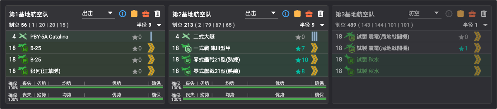

### 斩杀（ラスダン）
- 血条变化 / 装甲破碎流程：
- 友军选择：

## 乙/丙难度差异
- 

## 掉落
| 点位 | 掉落 | 难度限定 |
|------|------|----------|
| 待确认 | **Vautour**（新，法大型驱逐）、Richelieu、意战舰组（Cavour/Littorio/Roma）、Zara 等（官推；TsunDB 尚无样本） | 待确认 |
| N（P2 boss） | Commandant Teste（0.4% S限，TsunDB 孤例） | 待确认 |
| S（P3 boss） | Mogador（0.3% S限，TsunDB 孤例） | 待确认 |
| R | Pola（0.8% S限，TsunDB） | 待确认 |

## 突破奖励
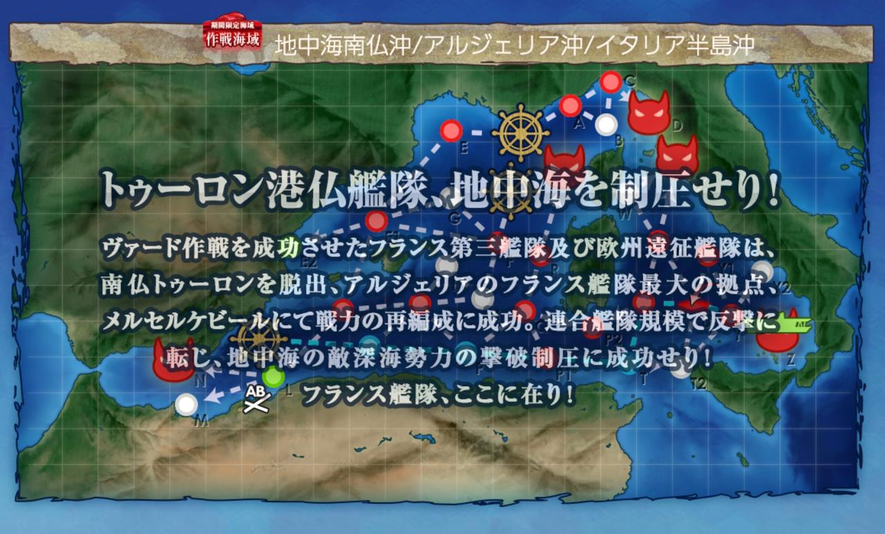

甲难度（清单引自 [kcwiki 攻略页](https://zh.kcwiki.cn/wiki/%E6%94%BB%E7%95%A5:2026%E5%B9%B4%E5%A4%8F%E5%AD%A3%E6%B4%BB%E5%8A%A8%E6%94%BB%E7%95%A5)，CC BY-NC-SA）：
- 20.3cm/50 連装砲改（SHS改良弹）★+3
- 二选一：13.8cm单装炮 Modèle 1927★+6 或 九七式中战车（中三）★+6
- 大发动艇（R35&法国兵）★+2
- 二选一：PL101（侦查）★+6 或 格纳库增设×3
- 55cm复合配置五连装鱼雷 Modèle 1932★+2、格纳库增设×7
- 战斗详报×1、勋章×2
- **重巡 Algérie**（新舰娘，通关合流）——为对抗意 Zara 级而建的法国重巡，土伦自沉的舰队旗舰

## 参考链接
- 
