# E5 ブレスト沖/大西洋/イギリス本土沖/バルト海【Au-delà du Destin Cruel】

> ✅ **E5 甲通关**（2026-07-23，P1~P4 全破）——**2026 夏活前后段全甲通关**。
> 官宣：**突破奖励＝法航母 Béarn**；**日枝丸＝本图掉落**（潜水舰队攻击专用 CI）。Visby（瑞典驱逐，拆包）仍待确认。
> 带路贴初版：**出发点×4**，札编号 [9]~[13]（kcwiki 札名：**不列颠救援艦隊、突撃艦隊、H艦隊、欧洲聯合艦隊、第二軽型分艦隊**，编号对应待确认；输送部队→②；机动/水打→②或③，③需 CV+CVB≤2 且 BB系≤4 且 CL+CT≥2 等；**④为决战大舰队札＝欧州連合艦隊（P4）**——BB系≥5／大和+武藏≥1／CV+CVB≥3／CA系≥3／**法国舰≥3／Algérie≥1** 任一即从④出发）。⚠️ 大和/武藏与 Algérie 均指向④＝最终决战主力，锁船规划预留。

> **海域**：[E1](../E1/概览.md) · [E2](../E2/概览.md) · [E3](../E3/概览.md) · [E4](../E4/概览.md) · **E5**
> **阶段**：[地图](#地图) · [倍卡](#特效倍卡) · [解谜1](#解谜1开-p1-boss第一阶段) · [解谜2](#解谜2开-p1-boss第二阶段) · [P1（攻坚）](#p1攻坚boss-g-点) · [P2（输送）](#p2输送boss-j2-点) · [解谜3](#解谜3开第三出发点) · [解谜4](#解谜4开-p3-boss) · [P3（攻坚）](#p3攻坚boss-s-点) · [P4/斩杀](#p4攻坚斩杀boss-zz-点) · [突破奖励](#突破奖励甲)

## 基本信息
- **作战名**：【Au-delà du Destin Cruel -フランス艦隊の躍動-】（残酷命运的彼方）
- **舞台**：布雷斯特近海 → 大西洋 → 英国本土近海 → 波罗的海（自布雷斯特港出击）
- **札与血条对应**（检证文档 2026-07-21）：**P1＝2ème Escadre Légère（第二轻型分舰队）· P2＝イギリス救援艦隊 · P3＝Force de Raid · 开P3解谜＝Force H · P4＝欧州連合艦隊**
  - 贴札位置：从③出发＝Force H；进 I 点＝イギリス救援艦隊；进 K 点＝Force de Raid；**H 点/C1 点不贴条**
  - ⚠️ **P3→P4 极易贴错条**——出发前逐舰核对出发点编成条件与 H 点分歧带路
- **阶段**（检证文档）：**开P1boss → 攻坚P1 → 输送P2 → 开第3出发点 → 开P3boss → 攻坚P3 → 攻坚P4 →（削甲）→ 斩杀P4**
- **P1 机制**：磨血段为**潜水艇 boss**，完整击破 4 次后变为**欧洲栖姬**（血条＝4×潜艇血量＋1×欧洲姬）
- **解锁条件**：推测需 E4 通关

## 地图
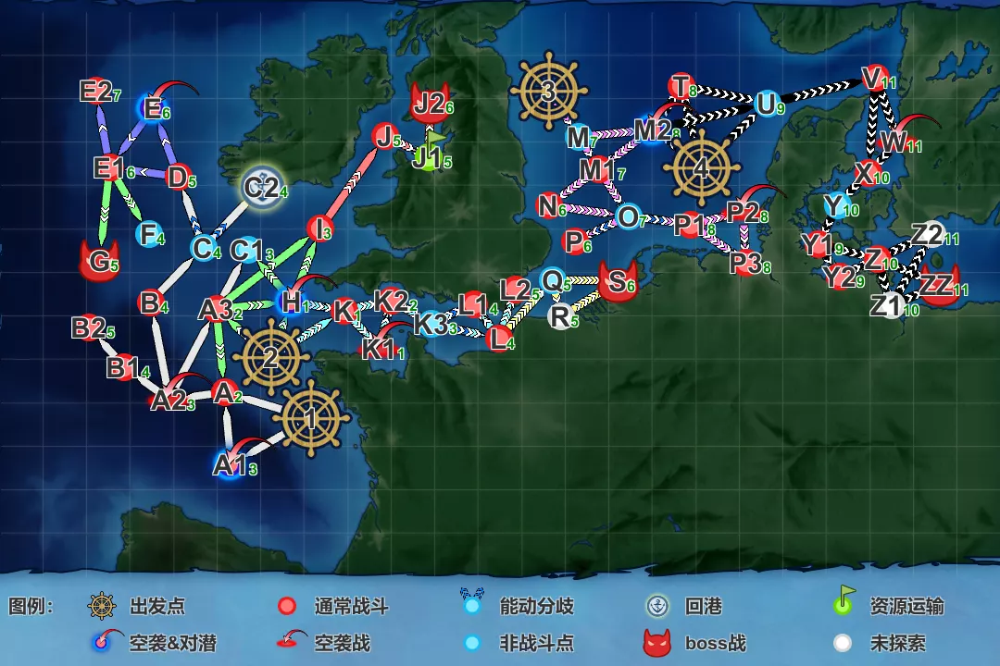

- **出发点×4**：①左下（比斯开湾方面）、②①上方、③左上（苏格兰方面）、④中右（波罗的海口）
- **boss 点**：**G**（P1，潜艇 boss→欧洲栖姬）；**J2**（P2 输送，J1 揚陸点）；**S**（P3，トーチカ要塞棲姫）；**ZZ**（P4 最终，仏蘭西空母籠姫）——均实测
- **回港点**：C2（推测，图上带特殊标记）

## 路线与机制
- 带路条件（阵容 → 路线）：见带路贴 E5 段（出发点×4；④＝决战大舰队札，触发条件见下方引文）
- 关键机制：P2 有**特殊运输 TP 加成**（参考表见检证文档）

## 特效（倍卡）
> 倍率数据见 [2026夏活检证情报文档](https://docs.google.com/document/d/1cJ66SdOAH_EIerB3OuGH05lXk7bTl45VGlwbYZRCqDg/edit?tab=t.0)

检证（2026-07-20，多数待确认）：
- **全图舰种**：DD 1.04 · CL 1.06 · AV 1.08
- **国籍**：**法 >1.7 · 英 1.4~1.5 · 德 1.3~1.4 · 瑞 1.2~1.3** · 苏 1.06 · 美 1.06 · 意 1.04
- **单独舰**：足柄 1.11
- **舰载机**：A1 1.07 · A2 1.05 · A3 1.03 · **Loire 130M／130M改(熟練) 1.12？**
- **对地装备组**：A/B/C 分组同 [E4](../E4/概览.md#特效倍卡)
- **点位追加**：**P2 boss J2**：DD 1.12 · CL 1.12 · AV？· 装备A 1.18／B 1.12／C 1.08

## 各阶段攻略
### 解谜1：开 P1 boss（第一阶段）
> ✅ 已完成（2026-07-21）

| 条件 | 次数 | 状态 |
|------|------|------|
| D 点 S 胜 | ×2 | ✅ |
| C2 点到达 | ×2 | ✅ |
| B2 点 S 胜 | ×2 | ✅ |
| 基地（防空）优势 | ×2 | ✅ |

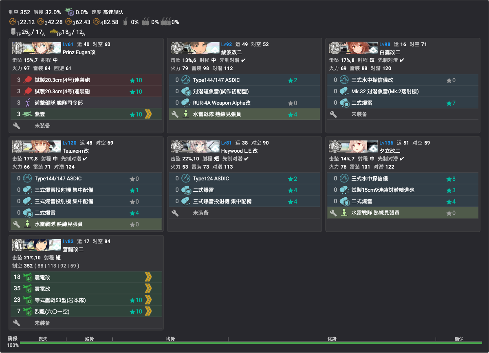

- **贴条**：「2ème Escadre Légère」（①出发，**7 舰全员新贴**，见[锁船表](../../00-活动总览/锁船表.md)）
- **编成**（7 舰游击，高速，制空 352）：Prinz Eugen改②（旗舰：**司令部退避**＋主炮＋水侦）、绫波改二／白露改二／Ташкент改／Heywood L.E.改／夕立改二（对潜特化）、苍龙改二（全战斗机）——B2 线把一个 DD 换成 **国后改（DE）** 转低速带路
- **路线**（①出发）：
  - **D**：1 → A（炸鱼）→ A2（空袭）→ B（水雷）→ C（能动）→ D（炸鱼）
  - **C2**：1 → A（炸鱼）→ A2（空袭）→ B（水雷）→ C（能动）→ **C2（无战斗）**
  - **B2**：1 → A（炸鱼）→ A1（空袭&对潜）→ A2（空袭）→ B1（水雷）→ **B2（潜水姬）**
- **阵型**：对潜（炸鱼/潜水姬）单横 · 空袭轮形 · 其余警戒
- 💡 **B2 需低速带路**——把一个 DD 换成 DE 即可

### 解谜2：开 P1 boss（第二阶段）
> ✅ 已完成（2026-07-21）

| 条件 | 次数 | 状态 |
|------|------|------|
| E2 点 S 胜 | ×2 | ✅ |
| 基地（防空）优势 | ×2 | ✅ |

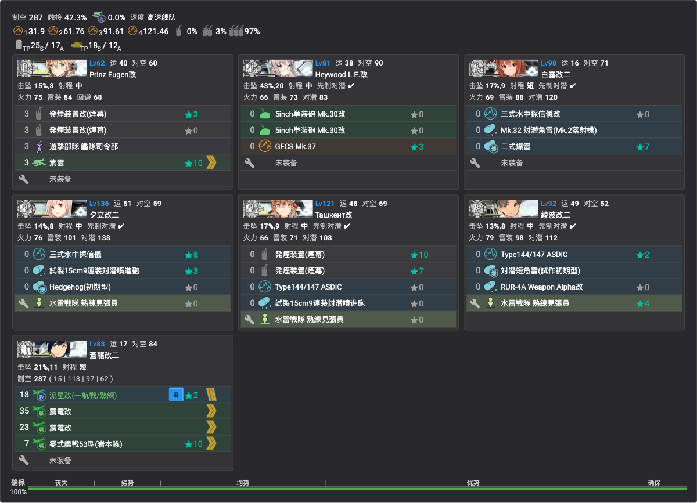

- **编成**（同队换装，无新锁）：Prinz Eugen改②（旗舰：司令部退避＋**拉烟**＋水侦）、Ташкент改（**拉烟**＋对潜）、Heywood L.E.改（主炮连击）、白露改二／夕立改二／绫波改二（对潜）、苍龙改二（舰攻＋战斗机，制空 287）
- **路线**：1 → A（炸鱼）→ A2（空袭）→ B（水雷）→ C（能动）→ D（炸鱼）→ E1（ラ级）→ **E2（潜水姬）**
- **阵型**：A 单横 · A2 轮形 · B 警戒 · D 单横 · E1 警戒 · **E2 单横**
- 💡 **E1 点拉烟**（Eugen＋Ташкент 发烟）

### P1（攻坚，boss G 点）
- ✅ **已击破**（2026-07-22）
- 札：2ème Escadre Légère
- **boss（两段）**：磨血段 **潜水夏姬II**（耐久 198）＋潜水ソ级×2＋ツ级＋后期ハ级×2；**海域血条低于 880 时变为欧洲栖姬**（耐久 880，装甲 205；随伴 ヌ级改＋リ级＋ツ级＋后期ハ级×2，**优势线 290**）
- **磨血编成**：同 [解谜2 E2 配置](#解谜2开-p1-boss第二阶段)——路线把 E2 换成 G 即可：**1 → A（炸鱼）→ A2（空袭）→ B（水雷）→ C（能动）→ D（炸鱼）→ E1（ラ级）→ G（boss，潜艇）**；阵型同（潜艇 boss **单横**），**E1 拉烟**
- **斩杀（欧洲栖姬段）**：同磨血路线，**boss 改单纵**

#### 斩杀编成（实战记录）
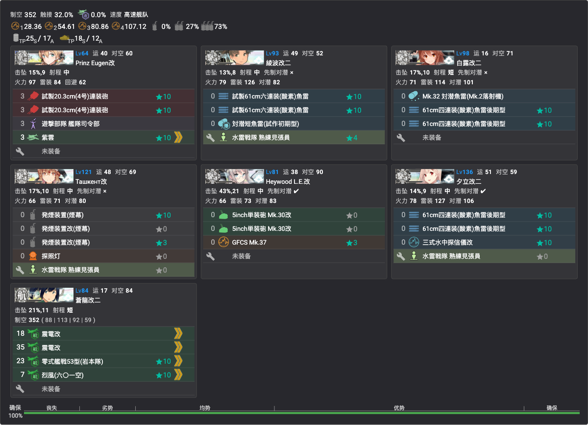

- **编成**（同队换装鱼雷 CI，无新锁，制空 352）：Prinz Eugen改②（旗舰：主炮＋司令部退避＋水侦）、绫波改二／白露改二／夕立改二（鱼雷 CI＋对潜）、Ташкент改（**拉烟×3＋探照灯**）、Heywood L.E.改（主炮连击）、苍龙改二（舰攻＋战斗机）
- **基地航空队**（三队全出击）：一队**东海对潜队**（PBY＋试制东海×2＋东海901空，半径9——磨血段打潜艇 boss）；二队诱导弹（二式大艇＋Fritz-X×2＋飛龍イ号，半径7）；三队诱导弹（二式大艇＋**Hs293D×2**＋Fritz-X，半径7）

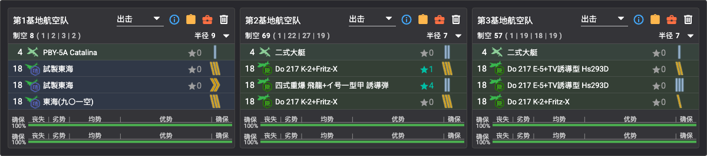

### P2（输送，boss J2 点）
- ✅ **已击破**（2026-07-22）
- **札**：「イギリス救援艦隊」（**进 I 点贴**，本队 12 舰全员新贴，见[锁船表](../../00-活动总览/锁船表.md)）；**特殊运输 TP 加成**
- **boss**：J2 点 **泊地水鬼 バカンスmode**——耐久 490，装甲 270；随伴 揚陸中ワ级II×2＋深海上陸小鬼×2~3（部分档带ル级；复纵，优势线 123）；J1 揚陸点
- **道中敌编成（甲）**：A3 ト级＋リ级×2＋ツ级＋后期ハ级×2；I **軽巡ウ级**（耐久 195）＋后期ハ级×4；J Schnellboot小鬼群×2＋リ级×2＋后期ハ级×2

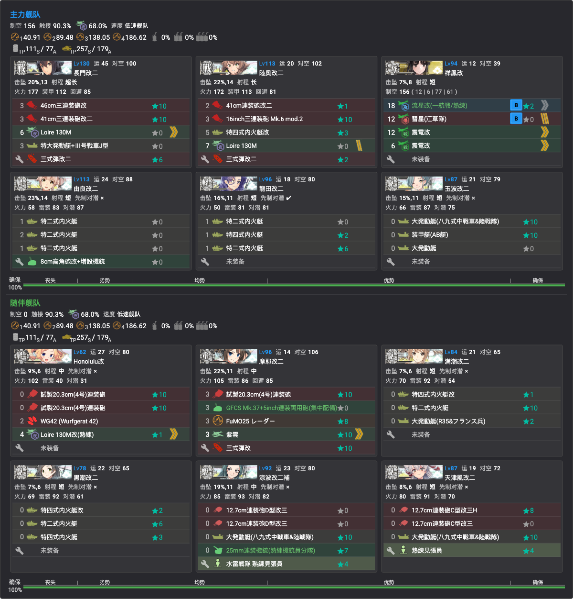

- **编成**（低速输送连合，制空 156，**实测每趟 TP 275(S)**——特殊运输加成后）：
  - 主力：**長門改二／陸奥改二**（主炮＋三式弹＋大发/内火艇——**长门摸**）、祥凤改②（攻击机＋战斗机）、由良改二／龙田改二（内火艇对地）、玉波改二（大发＋装甲艇）
  - 随伴：Honolulu改（主炮＋WG42）、摩耶改二（对空 CI＋三式弹）、满潮改二／黑潮改二（内火艇对地）、凉波改二补（大发＋机铳）、天津风改二③（连击＋大发）
- **路线**：**2（出发）→ A3（水雷）→ I（軽巡ウ级）→ J（水雷）→ J1（揚陸点）→ J2（boss）**
- **阵型**：A3 四阵 · I 四阵 · J 四阵 · **J2 二阵（长门摸）**
- 💡 **陆航攻击道中**：二/三队诱导弹（Fritz-X／Hs293D）压道中；一队东海队沿用 P1 配置（半径2）

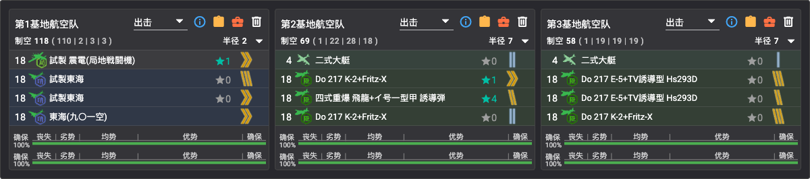

### 解谜3：开第三出发点
> ✅ 已完成（2026-07-22）。L1 需 **S 胜**、L2 **A 胜**即可。

| 条件 | 次数 | 状态 |
|------|------|------|
| L1 点 S 胜 | ×2 | ✅ |
| L2 点 A 胜 | ×2 | ✅ |

- **敌编成（甲）**：L1/L2 同款对地阵——**集积地棲姬IV（耐久 8000，「DJ」）**＋深海上陸小鬼×2（620）＋揚陸中ワ级II＋対空小鬼/Schnellboot（复纵，空优线 102）
- **编成**：同 [P3 攻坚编成](#p3攻坚boss-s-点)（Force de Raid，②出发）
- **路线**：
  - **L1**：2 → K（炸鱼）→ K2（水雷）→ K3（能动）→ **L1（集积地IV）**
  - **L2**：2 → K（炸鱼）→ K2（水雷）→ K3（能动）→ L（ル级）→ **L2（集积地IV）**
- **阵型**：K（炸鱼）一阵 · 道中（K2/L）二阵 · **目标点四阵（大和摸）**
- 💡 **陆航炸道中**（一队东海打 K 潜水点，二/三队诱导弹）

### 解谜4：开 P3 boss
> ✅ 已完成（2026-07-22）

| 条件 | 次数 | 状态 |
|------|------|------|
| P3 点 S 胜 | ×2 | ✅ |
| P 点 S 胜 | ×3 | ✅ |

- **敌编成（甲）**：P3 **集積地棲姫V バカンスmode**（**耐久 8600**，装甲 188，「DJ」）＋トーチカ小鬼×2＋対空小鬼＋ワ级×2（敌连合·三阵，随伴 ツ级＋ナ级Ⅱe＋后期ニ级×4，空优线 87）——重对地阵；P 点 **重巡ヰ级**（耐久 600，装甲 205）＋ツ级＋ナ级Ⅱe×2＋后期ニ级×2（单纵，部分档带ヌ级改，优势线 198）
- **道中敌编成（甲）**：M1 ト级＋リ级×2＋后期ニ级×3；P1 **空母夏姬II**（耐久 900）＋リ级×1~2＋ヘ级＋后期ニ级（轮形，优势线 315）

#### P3 点（实战记录）
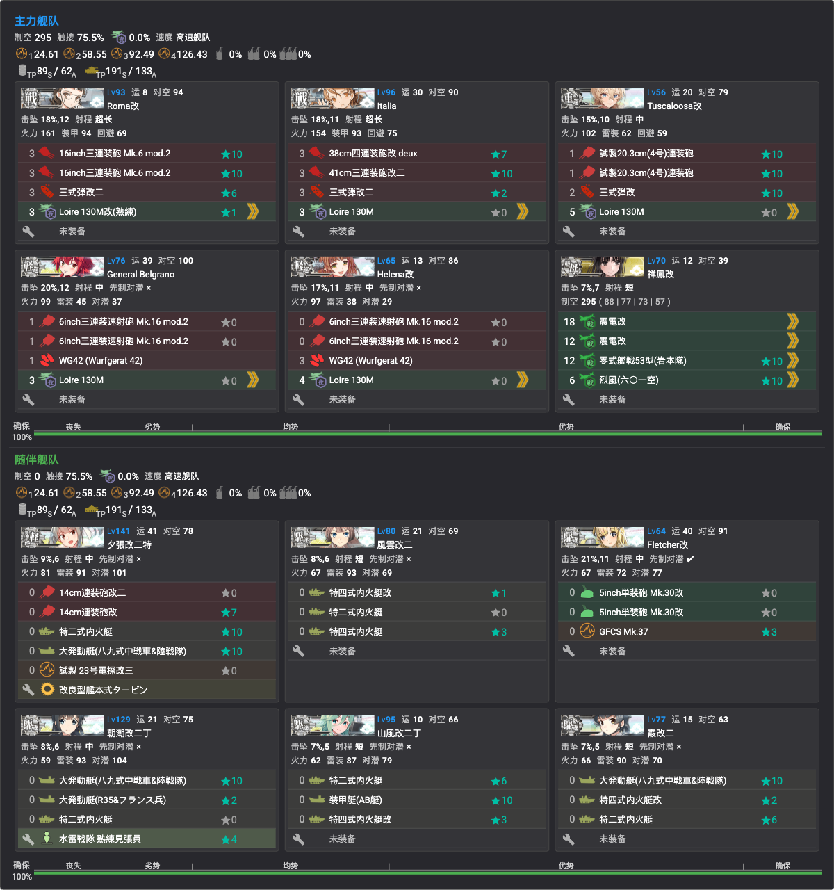

- **贴条**：「Force H」（**③出发，12 舰全员新贴**，见[锁船表](../../00-活动总览/锁船表.md)）
- **编成**（高速连合，制空 295）：
  - 主力：Roma改③／**Italia**（主炮＋三式弹）、Tuscaloosa改（主炮＋三式弹）、General Belgrano／Helena改（主炮＋WG42）、祥凤改③（全战斗机）
  - 随伴：夕张改二特（主炮＋内火艇＋大发战车）、风云改二／山风改二丁／霞改二③（内火艇对地）、朝潮改二丁（大发战车）、Fletcher改③（主炮连击）
- **路线**：**3（出发）→ M（无战斗）→ M1（水雷）→ O（能动）→ P1（空母夏姬II）→ P3（集积地V）**
- **阵型**：**全程四阵**（M1 · P1 · P3）

#### P 点（实战记录）
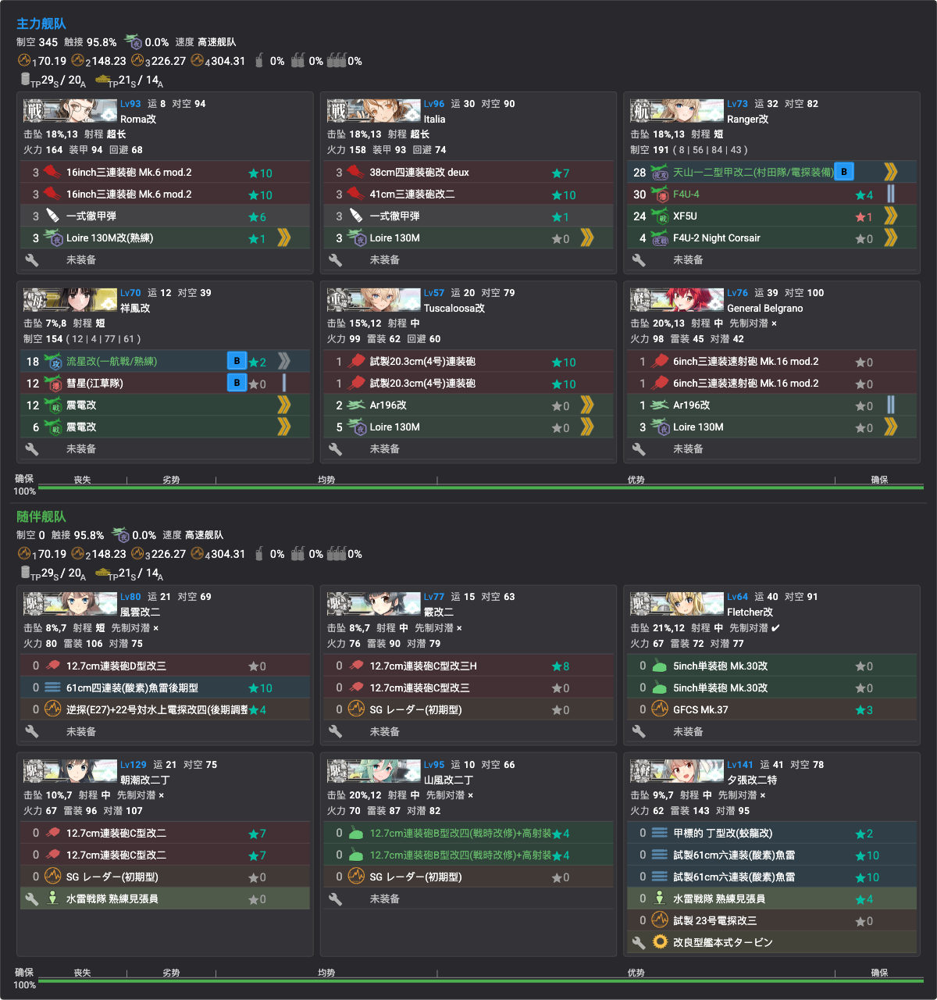

- **编成**（Force H 队换装对水上，**Ranger改为本队新贴**）：主力 Roma改③／Italia（主炮＋彻甲弹）、**Ranger改**（攻击机＋战斗机）、祥凤改③（舰攻＋战斗机）、Tuscaloosa改／Belgrano（主炮水侦）；随伴 风云改二（鱼雷 CI）、夕张改二特（甲标的＋鱼雷）、霞改二③／朝潮改二丁／山风改二丁（连击）、Fletcher改③（主炮连击）——制空 345
- **路线**：**3（出发）→ M（无战斗）→ M1（水雷）→ O（能动）→ P（重巡ヰ级）**
- **阵型**：M1 四阵 · **P 四阵**

### P3（攻坚，boss S 点）
- ✅ **已击破**（2026-07-22）
- **札**：「Force de Raid」（**进 K 点贴**，②出发，**12 舰全员新贴**，见[锁船表](../../00-活动总览/锁船表.md)）；开 P3 解谜用 Force H（③出发）
- **boss**：S 点 **トーチカ要塞棲姫**（用户称「碉堡姬」）——**耐久 1600**，装甲 170／斩杀段（-坏）215（敌连合·三阵，对地阵：随伴**集积地棲姬II**＋トーチカ小鬼×2＋対空小鬼，斩杀段追加ネ改II夏；空优线 74）
- **道中敌编成（甲）**：K 潜水ソ级×5（炸鱼）；K2 ト级＋リ级×2＋ツ级＋后期ニ级×2；L **ル级×2**＋后期ニ级×4
- **路线**：**2（出发）→ K（炸鱼）→ K2（水雷）→ K3（能动）→ L（ル级）→ Q（无战斗）→ S（boss）**
- **阵型**：K 一阵 · K2 二阵 · L 二阵 · **S 四阵（大和摸）**

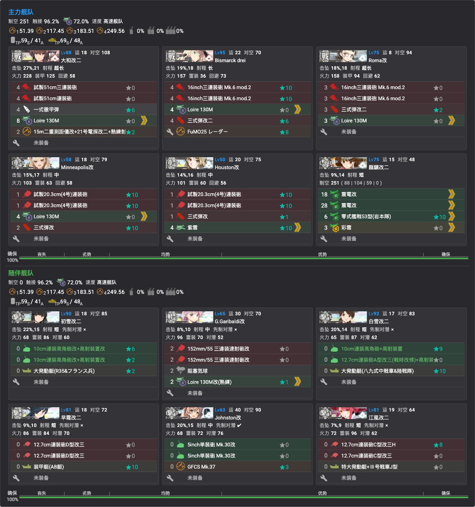

- **编成**（高速连合，制空 251）：
  - 主力：**大和改二③**（主炮＋彻甲弹＋水侦＋电探——**大和摸**）、**Bismarck drei**（主炮＋三式弹＋电探）、Roma改②／Minneapolis改／Houston改②（主炮＋三式弹）、龙骧改二（全战斗机＋彩云）
  - 随伴：初雪改二／白雪改二（对空 CI＋大发）、G.Garibaldi改（主炮＋**阻塞气球**）、早霜改二（连击＋装甲艇）、Johnston改②（主炮连击）、江风改二（连击＋大发战车）
- **基地航空队**（三队全出击）：一队东海对潜队（半径2，打 K 潜水点）；二队诱导弹（二式大艇＋Fritz-X×2＋飛龍イ号，半径7）；三队诱导弹（二式大艇＋Hs293D×2＋Fritz-X，半径7）

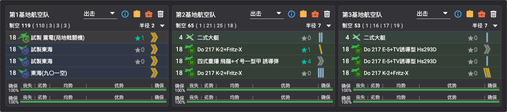

### P4（攻坚/斩杀，boss ZZ 点）
- ✅ **已击破**（2026-07-23，**E5 甲通关＝2026 夏活全甲**）
- 札：欧州連合艦隊（④出发，决战大舰队）；削甲后斩杀
- **boss**：ZZ 点 **仏蘭西空母籠姫**——**耐久 1220**，装甲 288／斩杀段（-坏）**338**（敌连合·四阵）
- **敌编成（甲）**：削血段 籠姬＋空母夏姬II＋**重巡ヰ级**＋ネ改II夏＋ツ级×2（随伴 ム级＋ナ级Ⅱe×2＋后期ニ级×3）——优势线 315；斩杀段 籠姬-坏＋空母夏姬II×2＋ヰ级-坏＋ネ改II夏×2——**优势线 630**
- **道中敌编成（甲）**：V **潜水新棲姬バカンス**（388）＋潜水ソ级×4（梯形）；X **タ级战舰×2**＋ヌ级改＋ツ级＋后期ニ级×2（优势线 198）；Y1 Schnellboot小鬼群×4；**Z「门神」＝ネ改II夏（耐久 470，装甲 244）**＋后期ニ级×5（单纵）
- **路线**：**4（出发）→ U（无战斗）→ V（潜水姬）→ X（タ级）→ Y（无战斗）→ Y1（PT）→ Z（门神）→ ZZ（boss）**
- **阵型**：V 一阵 · X 四阵 · Y1 四阵 · Z 四阵 · **ZZ 二阵（Richelieu 摸）**

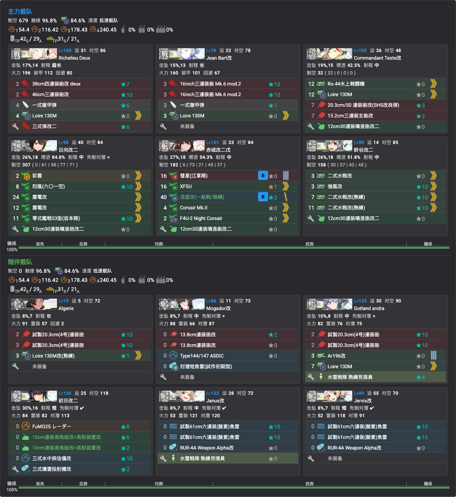

- **贴条**：「欧州連合艦隊」（④出发，**12 舰全员新贴**，见[锁船表](../../00-活动总览/锁船表.md)——含 **Algérie**（E4 奖励舰）与 Richelieu Deux②/Jean Bart改②/Teste改② 等多号机）
- **编成**（低速**水上打击**连合，制空 679）：
  - 主力：**Richelieu Deux②／Jean Bart改②**（主炮＋彻甲弹——**Richelieu 摸**）、Commandant Teste改②（主炮＋水战＋喷进炮）、**日向改二**（全战斗机＋喷进炮）、赤城改二戊（攻击机＋夜战机）、鈴谷改二（水战台）
  - 随伴：**Algérie**（主炮＋水侦）、Gotland andra②（主炮＋水侦）、初月改二（对空 CI＋对潜）、Janus改／Jervis改②（鱼雷 CI＋对潜）、Mogador改③（连击＋对潜）
- 💡 **带日向的用意**：凑成**水打连合**（道中我方第一舰队先打敌方舰队）＋全战斗机凑制空
- **基地航空队**（三队全出击，**陆航攻击道中**）：一队 二式大艇＋银河＋银河江草×2（半径11）；二队 二式大艇＋野中队×2＋银河（半径12）；三队**东海队**（二式大艇＋试制东海×2＋东海901，半径11——打 V 潜水点）

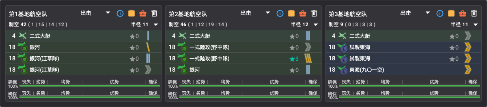

#### 斩杀最终编成（实战记录）
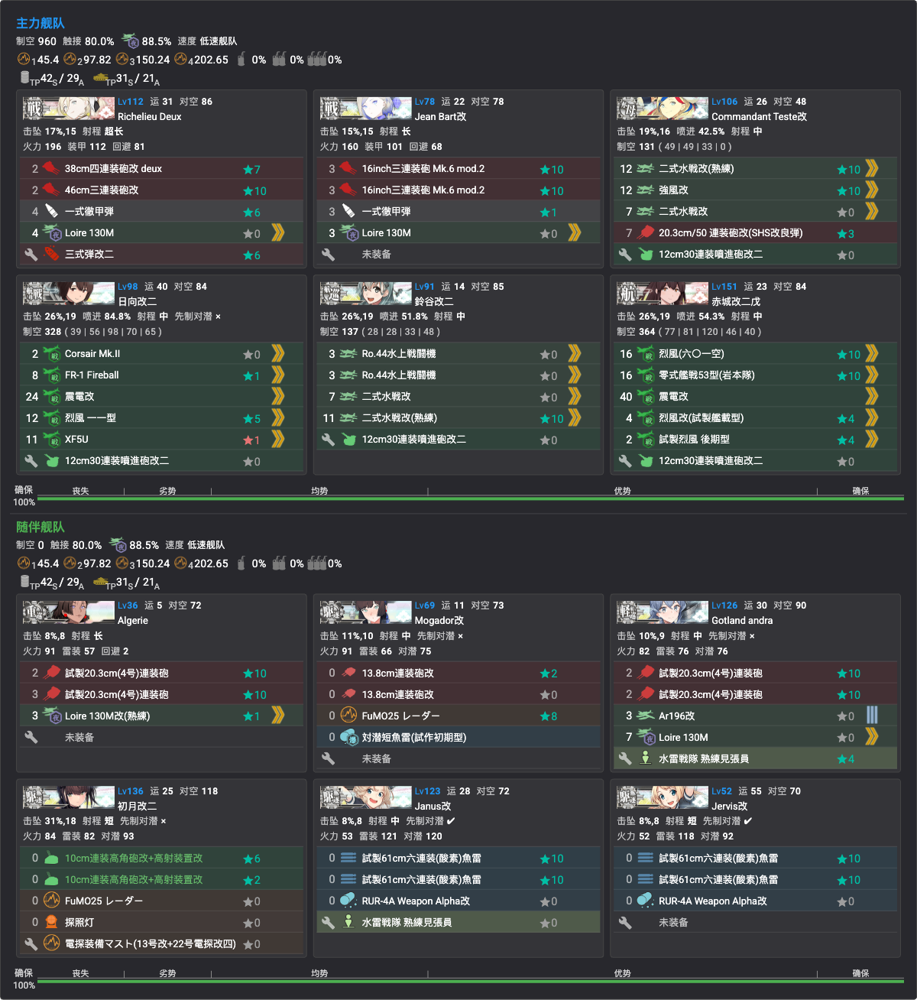

- **编成**（同队换装堆制空，无新锁，**制空 960**）：赤城改二戊改挂**全战斗机**、日向改二全战斗机、Teste改②全水战＋SHS 改良弹、鈴谷 Ro.44 水战台；随伴 初月改二（对空 CI＋探照灯）、Janus改／Jervis改②（鱼雷 CI＋RUR-4A）、Mogador改③（连击）、Algérie／Gotland andra②（主炮水侦）
- 路线/阵型同上（**ZZ 二阵 Richelieu 摸**）

### 突破奖励（甲）
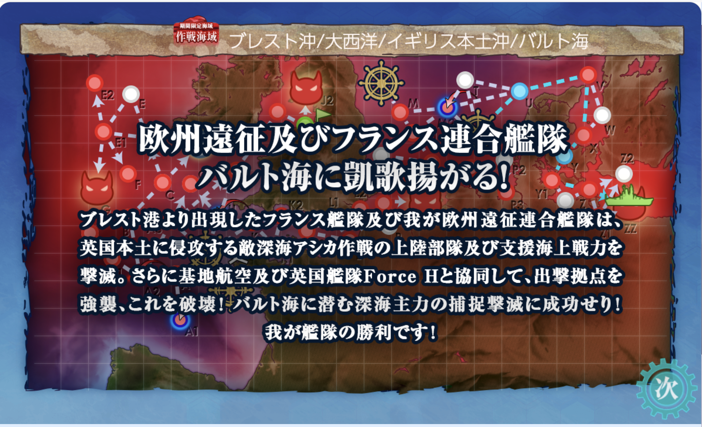

- **正規空母 Béarn**（新舰娘，通关合流）
- F4U-7★+1、**甲種勲章**、夜間熟練搭乗員
- 勋章×3、改修资材×10
- 二选一：格納庫増設×4 或 V-156F（SB2U 輸出型）★+4
- 二选一：格納庫増設×3 或 Bofors 12cm単装両用砲★+4
- 二选一：G-36A（F4F 輸出型）★+5 或 海外舰最新技术×5
- 💡 **P4 带路条件复杂，编成先验法**：先用**狗粮编成 3CA＋1CL＋2DD 的水打连合**进图贴上欧州連合艦隊札，再把**已贴条的 DD 换进主力舰队**试出击——**不满足 P4 条件会直接显示「无法出击」**，可在不误贴主力的前提下验证编成合法性
- 💡 **陆航航程**：P4 boss 点与潜水点均需**航程 11**＝**二式大艇＋半径 8 以上陆攻**——**有几个二式大艇才能派几队**；大艇不足时可将**航程 10 的一式陆攻二二型甲**队派往 **Z 点（「门神」，boss 前拦路点）**
- 待攻略

## 乙/丙难度差异
- 

## 掉落
| 点位 | 掉落 | 难度限定 |
|------|------|----------|
| 待确认 | **日枝丸**（新，官推）、Gotland、Nelson、Rodney、Warspite、Valiant、J 级驱逐姐妹、Bismarck、Graf Zeppelin 等（官推情报） | 待确认 |

## 参考链接
- 
