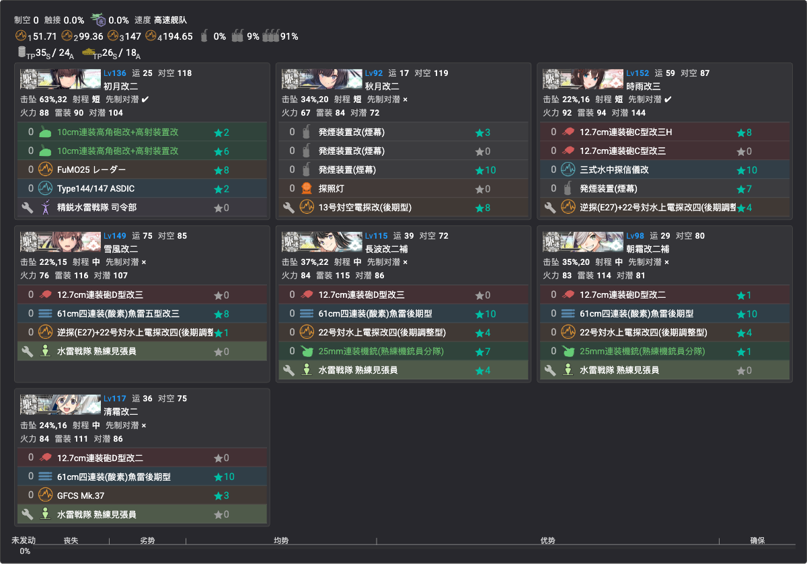

# 捞船点位与配置

> 全甲通关后的捞船期方案（2026-07-23 起）。掉率数据见[掉落一览](掉落一览.md)；**单舰队可出击的点位优先**（省资源、免连合编成）。

## 当前缺口与对应方案

### E1 X 点：花月＋桐＋凉月（一队三收，首选）
- **掉率（甲，kcwiki n=24013）**：花月 2.73%／桐 2.35%／凉月 1.03%——三舰合计约 6.1%/次；A 胜可掉但 **S 胜掉率更高，尽量 S**
- **编成**（✅已录入，见下图）：沿用 [E1 P3 攻坚编成](../02-海域攻略/E1/概览.md#p3攻坚-斩杀ラスダン)（7DD 游击，増強札，✅单舰队）——旗舰带游击司令部，防空 CI＋发烟担当＋水雷夜战组
- **路线** 2-M-P-Q-Q2-V2-V-X；⚠️ V→X 索敌门（系数4 ≥80）电探别拆
- **X 点（boss）拉烟**；**陆航可派 V 点（boss 前一点）**——通关后无空袭，可全力出击
- 顺带：第二十二号/第三〇号海防舰、冬月、杉、榧同点

### E3 X 点：Indiana（潜艇队，最省）
- **掉率**：0.52%（kcwiki）~0.86%（TsunDB）**S 限**
- **编成**：照抄 [E3 P3 潜艇队](../02-海域攻略/E3/概览.md#p3攻坚)（7 潜艇游击，✅单舰队）；斩杀关底支援可省
- 嫌 S 胜难 → **E3 Z 点连合 3.25%（S/A 可掉，争取 S）**（照抄 E3 P4 编成）或 E2 Y 点 2.53%
- Z 点顺带：伊13、Iowa、Lexington、Wasp、Saratoga（多为 S/A 可掉，Intrepid 为 S 限）

### E4 Z 点：Vautour＋Conte di Cavour（一队双收，TsunDB 2026-07-25）
- **掉率（甲，n=1475）**：Vautour **3.66%**／Conte di Cavour **1.15%**（均 S/A 可掉，S 更高）；同点顺带 Littorio 0.5%、G.Garibaldi 0.9%、Richelieu 0.3%、Mogador 0.2%（S/A），Aquila 0.6%、Zara 0.5%（S限）
- **编成**：照抄 [E4 P5 斩杀编成](../02-海域攻略/E4/概览.md#p5攻坚斩杀boss-z-点)（高速连合，仏地中海艦隊札，❌连合出击成本高）
- **路线** 3-O-P-P1-T-T1-U-Y-Z（一阵-一阵-三阵-四阵-boss二阵摸）；Y 点（ne改 门神）拉烟；陆航可派 Y/Z
- 通关后 boss 为满血 1200 非斩杀形态，特殊攻击照常削血拿 S

### E5 ZZ 点：日枝丸＋Visby＋速吸（一队三收，TsunDB 2026-07-25）
- **掉率（甲，n=1577）**：速吸 **3.42%**／**Visby 2.79%（拆包舰＝隐藏掉落实锤）**／日枝丸 **2.47%**（均 S/A 可掉）；顺带 Glorious 1.5%、まるゆ 1.1%（S限）、Nelson/Rodney 0.3~0.4%（S/A）
- **编成**：照抄 [E5 P4 斩杀最终编成](../02-海域攻略/E5/概览.md#p4攻坚斩杀boss-zz-点)（欧州連合艦隊札，❌连合＋陆航三队成本最高，但三新舰同点无可替代）
- **路线** 4-U-V-X-Y-Y1-Z-ZZ（一阵-四阵-四阵-四阵-boss二阵摸）；Z 点（ne改II 门神）陆航照旧
- **低成本替代（只求日枝丸）**：[E5 P2 输送编成](../02-海域攻略/E5/概览.md#p2输送boss-j2-点)打 J2 点 1.69%（**S限**，泊地水鬼 490 血，输送连合较省）；S 点 1.2%/P 点 0.8% 亦可但同样 S 限

### 天城／葛城
- **本活动全图零掉落，定案**：前段 kcwiki 全量＋后段 TsunDB 全边聚合（E4 n≈24,426／E5 n≈27,614）均无记录，不必再找

## 通用提示
- 捞船期锁船无新风险（全札已开），但仍**核对出发点/带路条件**避免误走
- **S 胜掉率高于 A 胜**——即使 A 胜可掉，打得过就争取 S；A 胜只作打不过时的保底
- 捞船编成的旗舰放 MVP 调整位练级两不误
