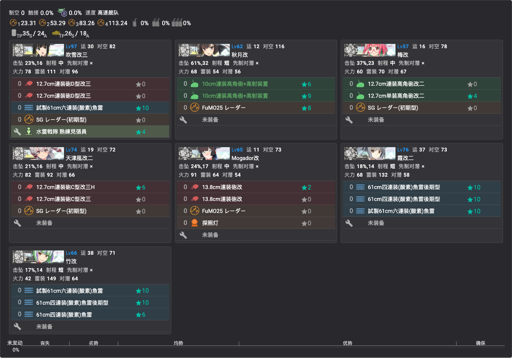

# E1 甲 出击记录（2026-07-09 突破）

> 非解谜（攻坚/输送）编成存档；解谜编成见 [E1 概览](../02-海域攻略/E1/概览.md#通关流程)。全程未使用支援舰队，未削甲。

## E1P1 攻坚（boss I 点，ヌ级 118 血）

- 秋月改（对空 CI＋FuMO25★8）、梅改、霞改二、天津风改二——4DD 高速，全员电探/逆探
- 陆航：银河(江草队)×2＋B-25×2，集中 boss
- 路线 1-A-B-E-G-H-I；A/E/G/H 警戒、I 单纵

## E1P2 输送（boss T 点，战舰夏姬 530 血）

- 文月改二、睦月改二、梅改、天津风改二、霞改二（各大发×3）＋千岁航改二（村田/友永★10/彗星六三四空/彩云）＋竹改（鱼雷 CI）——游击部队 7 舰，TP 150(S)
- 陆航：银河(熟练)×2＋B-25×2，集中 boss
- 路线 2-M-N-O-O2-R-T；N/O/O2 警戒、T 单纵

## E1P3 攻坚/斩杀（boss X 点，驱逐ラ级ζ 660 血）

- 吹雪改三（鱼雷 CI＋见张员）、秋月改（对空 CI）、梅改、天津风改二、Mogador改（探照灯）、霞改二（鱼雷 CI）、竹改（鱼雷 CI）——游击部队 7DD 高速
- 陆航：银河(熟练)×2＋B-25×2，集中 boss
- 路线 2-M-P-Q-Q2-V2-V-X；P 轮形、Q/Q2/V 警戒、X 单纵

## 资源消耗（截至 E1 突破）
| 项目 | 油 | 弹 | 钢 | 铝 | 高速建造材 | 桶 |
|------|------|------|------|------|------|------|
| 基地航空队 | -5160 | -1872 | 0 | -3758 | — | — |
| **活动总计** | **-8577** | **-4188** | **-2463** | **-4223** | 0 | **-86** |

- 总伤害输出（Overall Damage Dealt）：**58,613**
- 战斗中消耗应急修理要员/女神：**0**
